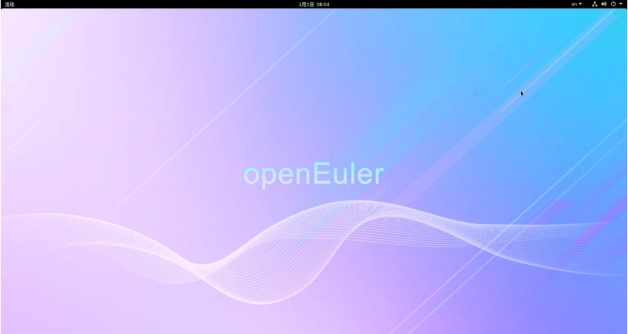

# Lab 0 实验报告

姓名 邹林壮 学号 202208040412

## 实验要求

本实验的目标是配置鲲鹏开发板的openEuler环境，包括烧录系统、安装必要的软件和验证环境配置。

## 实验难点

1. **系统烧录**：确保系统镜像的正确烧录，以及MD5校验的准确性，烧录这一步特别难搞。
2. **环境配置**：在openEuler系统中安装额外的软件和依赖，特别是Python 3.10的安装和配置。
3. **远程连接**：通过Tailscale实现对开发板的远程连接和操作。

## 实验设计

### 实验步骤

1. **烧录系统**：
   - 下载官方提供的openEuler 22.03 LTS SP4系统镜像。
   - 验证镜像文件的MD5值，确保下载的文件完整无误。
   - 使用烧录工具将系统镜像烧录到SD卡中。

2. **安装用户软件**：
   - 安装flex、gcc、bison等基础编译工具。
   - 安装毕昇编译器4.0.0 B014，基于LLVM版本17.0.6。
   - 安装Python 3.10并设为默认，以满足Autotuner的依赖要求。

3. **环境验证**：
   - 验证Python 3.10和Autotuner的安装是否成功。
   - 测试llvm-autotune和auto-tuner命令是否可用。

### 使用的工具和算法

- **系统镜像**：Kunpeng-Develop-openEuler-22.03-LTS-SP4-20241022-1438.img.xz
- **烧录工具**：根据官方指南推荐的烧录工具。
- **编译工具**：flex 2.6.4、gcc 10.3.1、bison 3.8.2。
- **编译器**：毕昇编译器 4.0.0 B014。
- **编程语言**：Python 3.10。

## 实验结果验证

### 验证展示

1. **系统烧录验证**：

   - 成功烧录系统镜像，并在开发板上启动openEuler系统。

   

   

2. **软件安装验证**：

   - 成功安装flex、gcc、bison等工具，并通过版本检查确认安装成功。
   - 成功安装毕昇编译器，并能通过命令行工具进行编译测试。

3. **Python环境验证**：

   - 成功安装Python 3.10，并设置为系统默认的Python版本。
   - 成功安装Autotuner，并能通过命令行工具进行基本的自动调优测试。

### 结果分析

实验结果表明，所有步骤均按照预期完成。系统烧录成功，所有必要的软件和工具均已正确安装并配置。Python环境的配置解决了Autotuner的依赖问题，使得后续的自动调优工作得以顺利进行。

## 实验反馈

本次实验过程中，系统烧录和环境配置均较为顺利。通过Tailscale实现的远程连接也为实验提供了便利，但是没有相关的指导手册，在有些地方会被卡住。实验报告非常详细，特别是系统烧录和环境配置的详细步骤，特别是对于我这种新手来说，减少了配置错误，提高实验效率。

## 附录

- **系统镜像下载链接**：[Kunpeng-Develop-openEuler-22.03-LTS-SP4-20241022-1438.img.xz](https://cowtransfer.com/s/e1a10e14f9304e)
- **MD5校验值**：a6b31c189f72c1cece5b23b4be9a414f

---

