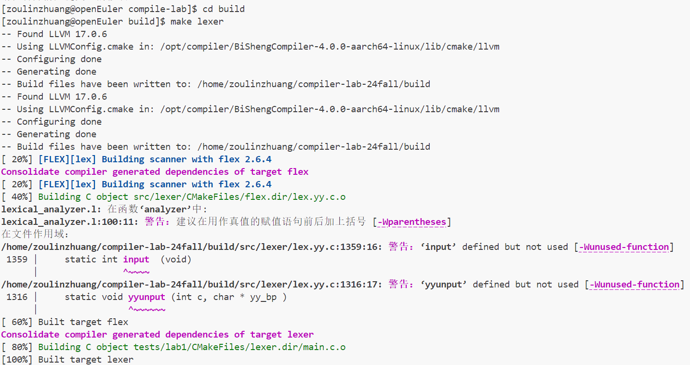
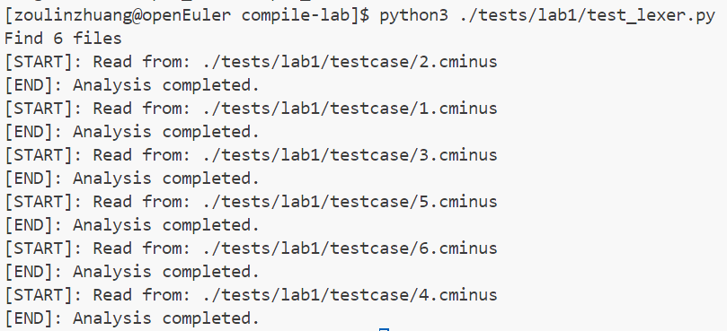
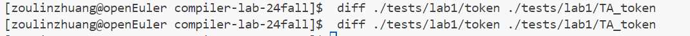

# Lab1实验报告

**学号**：202208040412
**姓名**：邹林壮

---

## 实验要求

本次实验需要各位同学根据 `cminux-f`的词法补全[lexical_analyer.l](../../src/lexer/lexical_analyzer.l)文件，完成词法分析器，能够输出识别出的 `token`，`type` ,`line(刚出现的行数)`，`pos_start(该行开始位置)`，`pos_end(结束的位置,不包含)`。如：

文本输入：

```c
 int a;
```

则识别结果应为：

```shell
int     280     1       2       5
a       285     1       6       7
;       270     1       7       8
```

具体的需识别token参考[lexical_analyzer.h](../../include/lexical_analyzer.h)

特别说明对于部分token，我们只需要进行过滤，即只需被识别，但是不应该被输出到分析结果中。因为这些token对程序运行不起到任何作用。

---

## 实验难点

1. **ARR与单个'['、']'的区分**

   - `ARR`是数组类型的标识，而单个 `[`和 `]`是独立的符号，在语义上具有不同的含义，需要通过上下文判断和正则表达式区分。

     这里的 `[]`专门用来表示array数组的声明
2. **注释正则表达式书写**

   - 针对注释的正则表达式考虑的情况较多，在实际应用中出现的情形需要格外注意。

     ```c++
     COMMENT  ("//"[^\n]*)|("/*"([^*]|\*+[^*/])*\*+"/")  
     ```

     这是最终的 `COMMENT`表示，使用 `//`或者 `/**/`都可以正常通过样例，针对 `/**/`需要特别注意当注释中出现 `*`时可以正确处理，所以将其分为了 `"[^*]`和 `\*+[^*/])*`表示其中可以在除去开头结尾的任意位置存在若干个 `*`，可以完美实现非嵌套型的注释正则匹配。
3. **关于letter的问题**

   - LETTER想要表达的意思，如果作为字母表示，会和IDENTIFIER冲突

     助教给的解释是可以忽略，也的确不影响最终结果
4. **错误输入处理**

   - 针对输入中可能出现的非法字符或格式，需要有健壮的错误处理机制。

     这里直接将不匹配的格式作为error进行输出，并在词法分析器中输出对应的内容，行号，起始位置和结束位置

     ```C++
      if (token == ERROR){
       sprintf(token_stream[index].text, "[ERR]: unable to analysize %s at %d line, from %d to %d", yytext, lines, pos_start, pos_end);
                     }
     ```
5. **关于flex的指导较少**

   - 在代码中会使用到yyleng和yytext，如全局变量 `yytext`、`yylex()`、`yyleng`的定义

---

## 实验设计

1. **工具选择与环境搭建**

   使用 `Flex`来编写正确的词法分析器程序

   默认系统为 ` openEuler 22.03 LTS SP4`，内核 `5.10.10`，烧录的镜像为 `Kunpeng-Develop-openEuler-22.03-LTS-SP4-20241022-1438`

   `flex 2.6.4`、`gcc 10.3.1`、`bison 3.8.2`
2. **需要识别的token**

   ```C++
   typedef enum cminus_token_type {
       //运算
       ADD = 259,              // +
       SUB = 260,              // -
       MUL = 261,              // *
       DIV = 262,              // /
       LT = 263,               // <
       LTE = 264,              // <=
       GT = 265,               // >
       GTE = 266,              // >=
       EQ = 267,               // ==
       NEQ = 268,              // !=
       ASSIN = 269,            // =
       //符号
       SEMICOLON = 270,        // ;
       COMMA = 271,            // ,
       LPARENTHESE = 272,      // (
       RPARENTHESE = 273,      // )
       LBRACKET = 274,         // [
       RBRACKET = 275,         // ]
       LBRACE = 276,           // {
       RBRACE = 277,           // }
       //关键字
       ELSE = 278,             // else 
       IF = 279,               // if 
       INT = 280,              // int
       FLOAT = 281,            // float
       RETURN = 282,           // return
       VOID = 283,             // void
       WHILE = 284,            // while
       //ID和NUM
       IDENTIFIER = 285,       // "Indicates identifiers, such as variable names, function names, etc."
       INTEGER = 286,          // "Indicates an integer value, such as 1, 2, 3, etc."
       FLOATPOINT = 287,       // "Indicates a floating point value, such as 1.1, 2.1, etc."
       ARRAY = 288,            // "Indicates an array declaration, such as int data[10]."
       LETTER = 289,           // "Indicates an alphabetic character, such as 'a'."
       //others
       EOL = 290,              // "Indicates a line terminator, such as '\n'."
       COMMENT = 291,          // "Indicates an annotation, such as // ..., etc."
       BLANK = 292,            // "Indicates blank characters, such as spaces, tabs, etc."
       ERROR = 258             // "Indicates an error or unrecognizable mark."

   } Token;
   ```
3. **设计token的正则表达式**

   **运算**

   ```C++
   "+" {pos_start=pos_end;pos_end=pos_start+yyleng;return ADD;}
   "-" {pos_start=pos_end;pos_end=pos_start+yyleng;return SUB;}
   "*" {pos_start=pos_end;pos_end=pos_start+yyleng;return MUL;} 
   "/" {pos_start=pos_end;pos_end=pos_start+yyleng;return DIV;}
   "<" {pos_start=pos_end;pos_end=pos_start+yyleng;return LT;}
   "<=" {pos_start=pos_end;pos_end=pos_start+yyleng;return LTE;}
   ">" {pos_start=pos_end;pos_end=pos_start+yyleng;return GT;}
   ">=" {pos_start=pos_end;pos_end=pos_start+yyleng;return GTE;}
   "==" {pos_start=pos_end;pos_end=pos_start+yyleng;return EQ;}
   "!=" {pos_start=pos_end;pos_end=pos_start+yyleng;return NEQ;}
   "=" {pos_start=pos_end;pos_end=pos_start+yyleng;return ASSIN;}
   ```

   符号

   ```C++
   ";" {pos_start=pos_end;pos_end=pos_start+yyleng;return SEMICOLON;}
   "," {pos_start=pos_end;pos_end=pos_start+yyleng;return COMMA;}
   "(" {pos_start=pos_end;pos_end=pos_start+yyleng;return LPARENTHESE;}
   ")" {pos_start=pos_end;pos_end=pos_start+yyleng;return RPARENTHESE;}
   "[" {pos_start=pos_end;pos_end=pos_start+yyleng;return LBRACKET;}
   "]" {pos_start=pos_end;pos_end=pos_start+yyleng;return RBRACKET;}
   "{" {pos_start=pos_end;pos_end=pos_start+yyleng;return LBRACE;}
   "}" {pos_start=pos_end;pos_end=pos_start+yyleng;return RBRACE;}

   ```

   **关键字**

   ```C++
   "else" {pos_start=pos_end;pos_end=pos_start+yyleng;return ELSE;}
   "if" {pos_start=pos_end;pos_end=pos_start+yyleng;return IF;}
   "int" {pos_start=pos_end;pos_end=pos_start+yyleng;return INT;}
   "float" {pos_start=pos_end;pos_end=pos_start+yyleng;return FLOAT;}
   "return" {pos_start=pos_end;pos_end=pos_start+yyleng;return RETURN;}
   "void" {pos_start=pos_end;pos_end=pos_start+yyleng;return VOID;}
   "while" {pos_start=pos_end;pos_end=pos_start+yyleng;return WHILE;}
   ```

   **ID和num**

   ```C++
   IDENTIFIER [a-zA-Z]+
   INTEGER 0|[1-9][0-9]*
   FLOATPOINT [0-9]*\.[0-9]*
   ARRAY \[\]
   LETTER \'.\' //这里的letter，我理解为字符类型中的'a'这种的，所以这里这样表示，并且在样例测试中没有出错

   {IDENTIFIER} {pos_start=pos_end;pos_end=pos_start+yyleng;return IDENTIFIER;}
   {INTEGER} {pos_start=pos_end;pos_end=pos_start+yyleng;return INTEGER;}
   {FLOATPOINT} {pos_start=pos_end;pos_end=pos_start+yyleng;return FLOATPOINT;}
   {ARRAY} {pos_start=pos_end;pos_end=pos_start+yyleng;return ARRAY;}
   {LETTER} {pos_start=pos_end;pos_end=pos_start+yyleng;return LETTER;}
   ```

   **其他不需要输出**

   这些内容的动作可以在analyzer函数中补充

   - 这里的注释 `COMMENT`正则表达式比较难写，在上方难点解释中说明了，另外在analyzer进行驱动时，需要考虑 `/n`,进行合理地换行
   - 针对空格来说，还应考虑tab空格的问题，所以考虑了\t和 

   ```C++
   LETTER \'.\'
   COMMENT  ("//"[^\n]*)|("/*"([^*]|\*+[^*/])*\*+"/")  
   BLANK ([ ]|[\t])+
   "\n" {return EOL;}
   {COMMENT} {return COMMENT;}
   {BLANK}  {pos_start=pos_end;pos_end+=yyleng;return BLANK;} 
   . {return ERROR;}


   case COMMENT:
      for(int i=0;i<yyleng;i++)
          if(yytext[i]=='\n'){
             pos_end=1;
             pos_start=1;
             lines++;
            }else pos_end++;
    case BLANK:
        break;
    case EOL:
        pos_start=1;
        pos_end=1;
        lines++;
        break;
    case ERROR:
         printf("[ERR]: unable to analysize %s at %d line, from %d to %d\n", yytext, lines, pos_start, pos_end);
   ```

---

## 实验结果验证

这是make的结果，成功




接下来执行py文件
```
python3 ./tests/lab1/test_lexer.py
```

执行成功

接着比较输出与答案所给的输出是否一致

输出与答案一致，测试通过。

以下是部分自定义的测试样例及运行结果：
### 输入代码1

```c
/******NA***/
int a;
/**//****/
int world=1;
```

输出结果
```
int	280	2	1	4
a	285	2	5	6
;	270	2	6	7
int	280	4	1	4
world	285	4	5	10
=	269	4	10	11
1	286	4	11	12
;	270	4	12	13
```
经过比照，行号和列号均正确，token类型也正确。

## 实验反馈
1.熟悉了FLEX文件的编写，并学会了知晓了其中的一些全局变量,如yytext、yylex、yyleng等，如何利用FLEX生成一个生成词法分析器，完成了实验

2.练习了多个token的正则表达式的书写，对正则表达式更加熟悉，特别是注释，letter等重点内容

3.针对输入中可能出现的非法字符或格式，有健壮的错误处理机制。
这里直接将不匹配的格式作为error进行输出，并在词法分析器中输出对应的内容，行号，起始位置和结束位置

4.实验说明中可以加入flex相关内容的基本说明，在代码中会使用到yyleng和yytext，如全局变量 `yytext`、`yylex()`、`yyleng`的定义