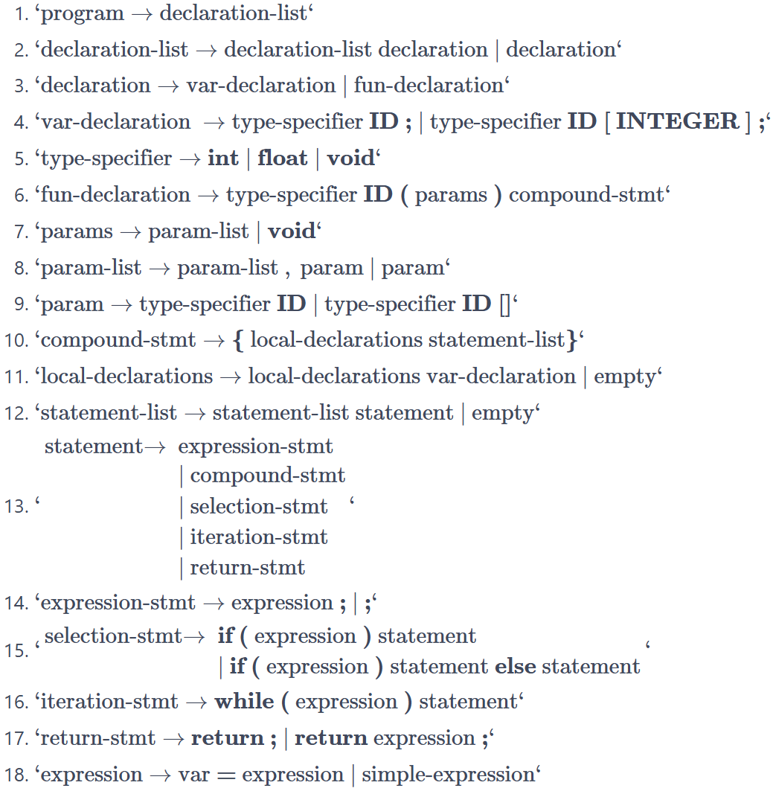
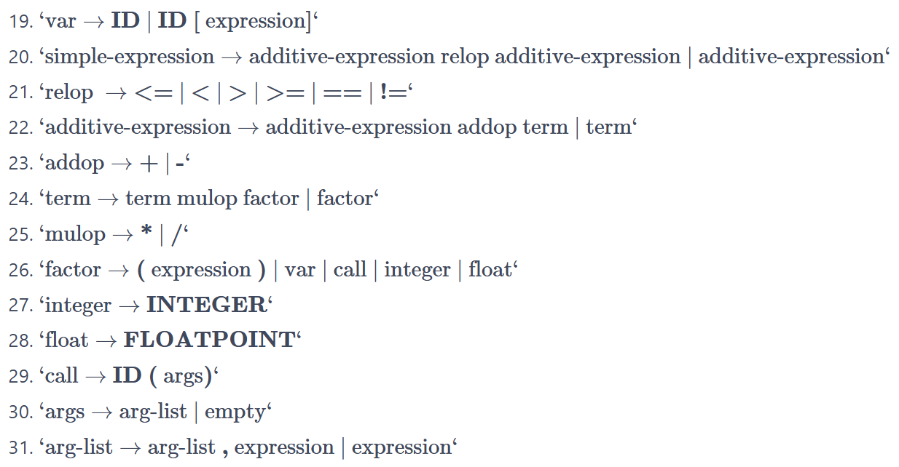
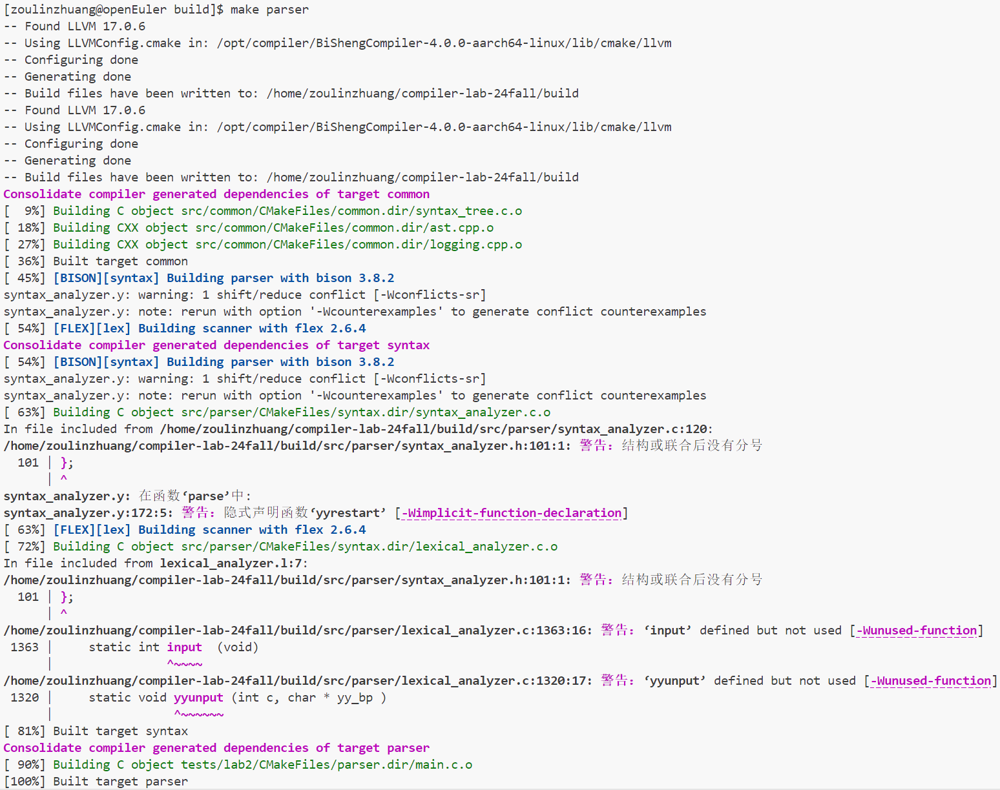
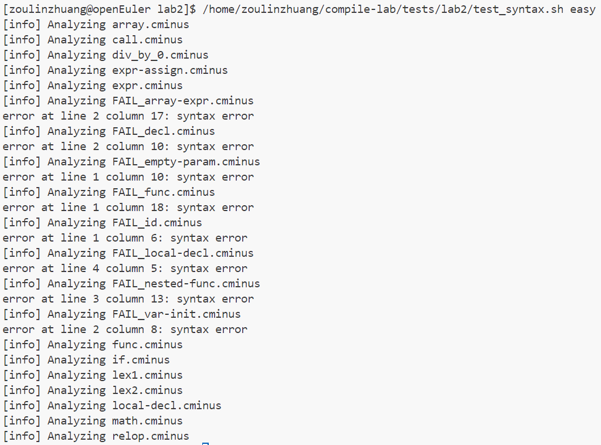
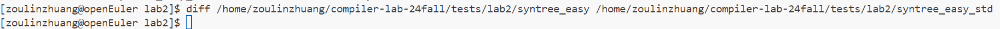
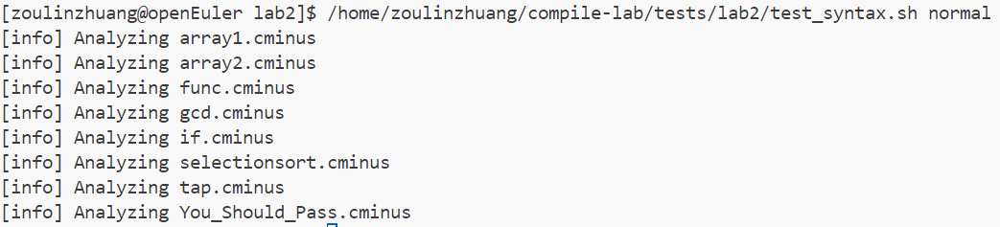
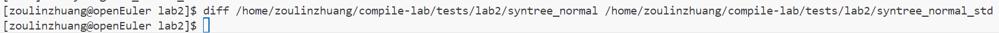

# lab2 实验报告

姓名 邹林壮 学号 202208040412


## 实验要求

该实验需要 $lab1$ 的词法部分复制到 `/src/parser` 目录的 [lexical_analyzer.l](https://gitee.com/cocoa18/cminus_compiler_2023_2024_Spring/blob/master/src/parser/lexical_analyzer.l)并合理修改相应部分，然后根据 `cminus-f` 的语法补全 [syntax_analyer.y](https://gitee.com/cocoa18/cminus_compiler_2023_2024_Spring/blob/master/src/parser/syntax_analyzer.y) 文件，完成语法分析器，要求最终能够输出解析树。如：

输入：

```
int bar;
float foo(void) { return 1.0; }
```

则 `parser` 将输出如下解析树：

```
>--+ program
|  >--+ declaration-list
|  |  >--+ declaration-list
|  |  |  >--+ declaration
|  |  |  |  >--+ var-declaration
|  |  |  |  |  >--+ type-specifier
|  |  |  |  |  |  >--* int
|  |  |  |  |  >--* bar
|  |  |  |  |  >--* ;
|  |  >--+ declaration
|  |  |  >--+ fun-declaration
|  |  |  |  >--+ type-specifier
|  |  |  |  |  >--* float
|  |  |  |  >--* foo
|  |  |  |  >--* (
|  |  |  |  >--+ params
|  |  |  |  |  >--* void
|  |  |  |  >--* )
|  |  |  |  >--+ compound-stmt
|  |  |  |  |  >--* {
|  |  |  |  |  >--+ local-declarations
|  |  |  |  |  |  >--* epsilon
|  |  |  |  |  >--+ statement-list
|  |  |  |  |  |  >--+ statement-list
|  |  |  |  |  |  |  >--* epsilon
|  |  |  |  |  |  >--+ statement
|  |  |  |  |  |  |  >--+ return-stmt
|  |  |  |  |  |  |  |  >--* return
|  |  |  |  |  |  |  |  >--+ expression
|  |  |  |  |  |  |  |  |  >--+ simple-expression
|  |  |  |  |  |  |  |  |  |  >--+ additive-expression
|  |  |  |  |  |  |  |  |  |  |  >--+ term
|  |  |  |  |  |  |  |  |  |  |  |  >--+ factor
|  |  |  |  |  |  |  |  |  |  |  |  |  >--+ float
|  |  |  |  |  |  |  |  |  |  |  |  |  |  >--* 1.0
|  |  |  |  |  |  |  |  >--* ;
|  |  |  |  |  >--* }
```

请注意，上述解析树含有每个解析规则的所有子成分，包括诸如 `;` `{` `}` 这样的符号，请在编写规则时务必不要忘了它们。

## 实验难点

1. 了解`bison`的基础知识和理解`Cminus-f`语法
2. 了解`bison`与`flex`之间是如何协同工作，flex对bison的影响
3. 参考所给的语法规则，实验要求的上下无关文法的正确编写

## 实验设计

- 将lab1的词法部分复制到lab2的词法部分的文件中，并进行修改，将所有的动作都直接放到语法规则的后面

  进行分析得知，该实验中要构建一颗树，在该树种所有识别的词为树的叶子节点。观察`.\src\parser\lexical_analyzer.l`文件

  ```c++
  void pass_node(char *text){
  
     yylval.node =new_syntax_tree_node(text);
  
  }
  ```

  该函数为构建名字为text的叶子节点。

  所以要修改`.\src\parser\lexical_analyzer.l`文件，通过观察得知该文件中也不需要`analyzer`函数，去除了analyzer函数，但是analyzer函数的功能还是需要保留着。

最终的.l文件修改如下

```c
%option noyywrap
%{
#include <stdio.h>
#include <stdlib.h>

#include "syntax_tree.h"
#include "syntax_analyzer.h"

int files_count;
int lines;
int pos_start;
int pos_end;

void pass_node(char *text){
     yylval.node = new_syntax_tree_node(text);
}
%}

/***************
 TO STUDENTS: Copy your Lab1 here. Make adjustments if necessary.

  Note: don't modify the prologue unless you know what you are doing.
***************/
IDENTIFIER [a-zA-Z]+
INTEGER 0|[1-9][0-9]*
FLOATPOINT [0-9]*\.[0-9]*
ARRAY \[\]
LETTER \'.\'
COMMENT  ("//"[^\n]*)|("/*"([^*]|\*+[^*/])*\*+"/")  
BLANK ([ ]|[\t])+
%%

"+" {pos_start=pos_end;pos_end=pos_start+yyleng;pass_node(yytext);return ADD;}
"-" {pos_start=pos_end;pos_end=pos_start+yyleng;pass_node(yytext);return SUB;}
"*" {pos_start=pos_end;pos_end=pos_start+yyleng;pass_node(yytext);return MUL;} 
"/" {pos_start=pos_end;pos_end=pos_start+yyleng;pass_node(yytext);return DIV;}
"<" {pos_start=pos_end;pos_end=pos_start+yyleng;pass_node(yytext);return LT;}
"<=" {pos_start=pos_end;pos_end=pos_start+yyleng;pass_node(yytext);return LTE;}
">" {pos_start=pos_end;pos_end=pos_start+yyleng;pass_node(yytext);return GT;}
">=" {pos_start=pos_end;pos_end=pos_start+yyleng;pass_node(yytext);return GTE;}
"==" {pos_start=pos_end;pos_end=pos_start+yyleng;pass_node(yytext);return EQ;}
"!=" {pos_start=pos_end;pos_end=pos_start+yyleng;pass_node(yytext);return NEQ;}
"=" {pos_start=pos_end;pos_end=pos_start+yyleng;pass_node(yytext);return ASSIN;}


";" {pos_start=pos_end;pos_end=pos_start+yyleng;pass_node(yytext);return SEMICOLON;}
"," {pos_start=pos_end;pos_end=pos_start+yyleng;pass_node(yytext);return COMMA;}
"(" {pos_start=pos_end;pos_end=pos_start+yyleng;pass_node(yytext);return LPARENTHESE;}
")" {pos_start=pos_end;pos_end=pos_start+yyleng;pass_node(yytext);return RPARENTHESE;}
"[" {pos_start=pos_end;pos_end=pos_start+yyleng;pass_node(yytext);return LBRACKET;}
"]" {pos_start=pos_end;pos_end=pos_start+yyleng;pass_node(yytext);return RBRACKET;}
"{" {pos_start=pos_end;pos_end=pos_start+yyleng;pass_node(yytext);return LBRACE;}
"}" {pos_start=pos_end;pos_end=pos_start+yyleng;pass_node(yytext);return RBRACE;}


"else" {pos_start=pos_end;pos_end=pos_start+yyleng;pass_node(yytext);return ELSE;}
"if" {pos_start=pos_end;pos_end=pos_start+yyleng;pass_node(yytext);return IF;}
"int" {pos_start=pos_end;pos_end=pos_start+yyleng;pass_node(yytext);return INT;}
"float" {pos_start=pos_end;pos_end=pos_start+yyleng;pass_node(yytext);return FLOAT;}
"return" {pos_start=pos_end;pos_end=pos_start+yyleng;pass_node(yytext);return RETURN;}
"void" {pos_start=pos_end;pos_end=pos_start+yyleng;pass_node(yytext);return VOID;}
"while" {pos_start=pos_end;pos_end=pos_start+yyleng;pass_node(yytext);return WHILE;}


{IDENTIFIER} {pos_start=pos_end;pos_end=pos_start+yyleng;pass_node(yytext);return IDENTIFIER;}
{INTEGER} {pos_start=pos_end;pos_end=pos_start+yyleng;pass_node(yytext);return INTEGER;}
{FLOATPOINT} {pos_start=pos_end;pos_end=pos_start+yyleng;pass_node(yytext);return FLOATPOINT;}
{ARRAY} {pos_start=pos_end;pos_end=pos_start+yyleng;pass_node(yytext);return ARRAY;}
{LETTER} {pos_start=pos_end;pos_end=pos_start+yyleng;pass_node(yytext);return LETTER;}


[\n]+ {pos_start=1;pos_end=1;lines+=yyleng;}
{COMMENT} {for(int i=0;i<yyleng;i++)
                if(yytext[i]=='\n'){
                        pos_end=1;
                        pos_start=1;
                        lines++;
                    }else pos_end++;
                    }
{BLANK} {pos_start = pos_end;pos_end+=yyleng;}
. {printf("error!\n");}


%%

// /* Example for you :-) */
// \+  { pos_start = pos_end; pos_end += 1; pass_node(yytext); return ADD; }

```


- 还需要补全`.\src\parser\syntax_analyzer.y`



  根据以上下文无关文法，补全文件，补全部分：

 ```c
%{
#include <stdio.h>
#include <stdlib.h>
#include <string.h>
#include <stdarg.h>

#include "syntax_tree.h"

// external functions from lex
extern int yylex();
extern FILE* yyin;
// external variables from lexical_analyzer module
extern int lines;
extern char *yytext;
extern int pos_end;
extern int pos_start;

// Global syntax tree
syntax_tree *gt;

// Error reporting
void yyerror(const char *s);

// Helper functions written for you with love
syntax_tree_node *node(const char *node_name, int children_num, ...);
%}

/* TODO: Complete this definition. */
%union {syntax_tree_node *node}

%type <node> program declaration-list declaration var-declaration
%type <node> type-specifier fun-declaration params param-list param 
%type <node> compound-stmt local-declarations statement-list statement
%type <node> expression expression-stmt selection-stmt iteration-stmt return-stmt 
%type <node> var simple-expression relop additive-expression
%type <node> addop term mulop factor integer float call args arg-list
%token <node> ADD SUB MUL DIV LT LTE GT GTE EQ NEQ ASSIN
%token <node> SEMICOLON COMMA LPARENTHESE RPARENTHESE LBRACKET RBRACKET LBRACE RBRACE
%token <node> ELSE IF INT FLOAT RETURN VOID WHILE
%token <node> IDENTIFIER INTEGER FLOATPOINT ARRAY LETTER
/* TODO: Your tokens here. */

%start program

%%
/* TODO: Your rules here. */

program : declaration-list { $$ = node("program", 1, $1); gt->root = $$; }
        ;
declaration-list : declaration-list declaration { $$ = node("declaration-list", 2, $1,$2);}
                 | declaration { $$ = node("declaration-list", 1, $1);}
                 ;
declaration : var-declaration { $$ = node("declaration", 1, $1);}
            | fun-declaration { $$ = node("declaration", 1, $1);}
            ;
var-declaration : type-specifier IDENTIFIER SEMICOLON {$$ = node("var-declaration",3,$1,$2,$3);}
                | type-specifier IDENTIFIER LBRACKET INTEGER RBRACKET SEMICOLON {$$ = node("var-declaration",6,$1,$2,$3,$4,$5,$6);}
                ; 
type-specifier : INT { $$ = node("type-specifier", 1, $1);}
               | FLOAT { $$ = node("type-specifier", 1, $1);}
               | VOID { $$ = node("type-specifier", 1, $1);}
               ;
fun-declaration : type-specifier IDENTIFIER LPARENTHESE params RPARENTHESE compound-stmt { $$ = node("fun-declaration", 6, $1,$2,$3,$4,$5,$6);}
                ;
params : param-list { $$ = node("params", 1, $1);}
       | VOID { $$ = node("params", 1, $1);}
       ;
param-list : param-list COMMA param { $$ = node("param-list", 3, $1,$2,$3);}
           | param { $$ = node("param-list", 1, $1);}
           ;
param : type-specifier IDENTIFIER { $$ = node("param", 2, $1,$2);}
      | type-specifier IDENTIFIER ARRAY { $$ = node("param", 3, $1,$2,$3);}
      ; 
compound-stmt : LBRACE local-declarations statement-list RBRACE { $$ = node("compound-stmt", 4, $1,$2,$3,$4);}
              ;
local-declarations : local-declarations var-declaration { $$ = node("local-declarations", 2, $1,$2);}
                   | { $$ = node("local-declarations", 0);}
                   ;
statement-list : statement-list statement { $$ = node("statement-list", 2, $1,$2);}
               | {$$ = node("statement-list",0);}
               ;
statement : expression-stmt { $$ = node("statement", 1, $1);}
          | compound-stmt { $$ = node("statement", 1, $1);}
          | selection-stmt { $$ = node("statement", 1, $1);}
          | iteration-stmt { $$ = node("statement", 1, $1);}
          | return-stmt { $$ = node("statement", 1, $1);}
          ;
expression-stmt : expression SEMICOLON { $$ = node("expression-stmt", 2, $1,$2);}
                | SEMICOLON { $$ = node("expression-stmt", 1, $1);}
                ;
selection-stmt : IF LPARENTHESE expression RPARENTHESE statement { $$ = node("selection-stmt", 5, $1,$2,$3,$4,$5);}
               | IF LPARENTHESE expression RPARENTHESE statement ELSE statement { $$ = node("selection-stmt", 7, $1,$2,$3,$4,$5,$6,$7);}
               ;
iteration-stmt : WHILE LPARENTHESE expression RPARENTHESE statement { $$ = node("iteration-stmt", 5, $1,$2,$3,$4,$5);}
               ; 
return-stmt : RETURN SEMICOLON { $$ = node("return-stmt", 2, $1,$2);}
            | RETURN expression SEMICOLON { $$ = node("return-stmt", 3, $1,$2,$3);}
            ;
expression : var ASSIN expression { $$ = node("expression", 3, $1,$2,$3);}
           | simple-expression { $$ = node("expression", 1, $1);}
           ;
var : IDENTIFIER { $$ = node("var", 1, $1);}
    | IDENTIFIER LBRACKET expression RBRACKET { $$ = node("var", 4, $1,$2,$3,$4);}
    ;
simple-expression : additive-expression relop additive-expression { $$ = node("simple-expression", 3, $1,$2,$3);}
                  | additive-expression { $$ = node("simple-expression", 1, $1);}
                  ;
relop : LTE { $$ = node("relop", 1, $1);}
      | LT { $$ = node("relop", 1, $1);}
      | GT { $$ = node("relop", 1, $1);}
      | GTE { $$ = node("relop", 1, $1);}
      | EQ { $$ = node("relop", 1, $1);}
      | NEQ { $$ = node("relop", 1, $1);}
      ;
additive-expression : additive-expression addop term { $$ = node("additive-expression", 3, $1,$2,$3);}
                    | term { $$ = node("additive-expression", 1, $1);}     
                    ;
addop : ADD { $$ = node("addop", 1, $1);}  
      | SUB { $$ = node("addop", 1, $1);}  
      ;
term : term mulop factor { $$ = node("term", 3, $1,$2,$3);}
     | factor { $$ = node("term", 1, $1);}
     ;   
mulop : MUL { $$ = node("mulop", 1, $1);} 
      | DIV { $$ = node("mulop", 1, $1);} 
      ;
factor : LPARENTHESE expression RPARENTHESE { $$ = node("factor", 3, $1,$2,$3);}
       | var { $$ = node("factor", 1, $1);} 
       | call { $$ = node("factor", 1, $1);} 
       | integer { $$ = node("factor", 1, $1);} 
       | float { $$ = node("factor", 1, $1);} 
       ;
integer : INTEGER { $$ = node("integer", 1, $1);} 
        ;
float : FLOATPOINT { $$ = node("float", 1, $1);} 
      ;
call : IDENTIFIER LPARENTHESE args RPARENTHESE { $$ = node("call", 4, $1,$2,$3,$4);}
     ;
args : arg-list { $$ = node("args", 1, $1);} 
     | { $$ = node("args", 0);} 
     ;
arg-list : arg-list COMMA expression { $$ = node("arg-list", 3, $1,$2,$3);}
         | expression { $$ = node("arg-list", 1, $1);} 
         ;
%%  

/// The error reporting function.
void yyerror(const char *s)
{
    // TO STUDENTS: This is just an example.
    // You can customize it as you like.
    fprintf(stderr, "error at line %d column %d: %s\n", lines, pos_start, s);
}

/// Parse input from file `input_path`, and prints the parsing results
/// to stdout.  If input_path is NULL, read from stdin.
///
/// This function initializes essential states before running yyparse().
syntax_tree *parse(const char *input_path)
{
    if (input_path != NULL) {
        if (!(yyin = fopen(input_path, "r"))) {
            fprintf(stderr, "[ERR] Open input file %s failed.\n", input_path);
            exit(1);
        }
    } else {
        yyin = stdin;
    }

    lines = pos_start = pos_end = 1;
    gt = new_syntax_tree();
    yyrestart(yyin);
    yyparse();
    return gt;
}

/// A helper function to quickly construct a tree node.
///
/// e.g.
///     $$ = node("program", 1, $1);
///     $$ = node("local-declarations", 0);
syntax_tree_node *node(const char *name, int children_num, ...)
{
    syntax_tree_node *p = new_syntax_tree_node(name);
    syntax_tree_node *child;
    if (children_num == 0) {
        child = new_syntax_tree_node("epsilon");
        syntax_tree_add_child(p, child);
    } else {
        va_list ap;
        va_start(ap, children_num);
        for (int i = 0; i < children_num; ++i) {
            child = va_arg(ap, syntax_tree_node *);
            syntax_tree_add_child(p, child);
        }
        va_end(ap);
    }
    return p;
}

 ```


  

## 实验结果验证

首先进行编译

编译成功

接着进行样例的测试

分别测试easy测试案例，normal测试案例


easy测试案例：




可以看到easy测试案例的输出结果与答案完全一致

normal测试案例





可以看到normal测试案例的输出结果与答案完全一致

然后是自己测试的样例

```C++
int a;
int cmp(int a, int b)
{
	int c;
	c = a;
    if(a > b)
    {
        c = a - b;
    }
    else
    {
        c = b - a;
    }
    
	return c;
}

void function(int a){
    int i;
    int sum;
    i = 0;
    sum = 0;
    while(i<100)
    {
        sum = sum + i;
        i = i+1;
    }
    }
```

最后得到的输出为

```C++
>--+ program
|  >--+ declaration-list
|  |  >--+ declaration-list
|  |  |  >--+ declaration-list
|  |  |  |  >--+ declaration
|  |  |  |  |  >--+ var-declaration
|  |  |  |  |  |  >--+ type-specifier
|  |  |  |  |  |  |  >--* int
|  |  |  |  |  |  >--* a
|  |  |  |  |  |  >--* ;
|  |  |  >--+ declaration
|  |  |  |  >--+ fun-declaration
|  |  |  |  |  >--+ type-specifier
|  |  |  |  |  |  >--* int
|  |  |  |  |  >--* cmp
|  |  |  |  |  >--* (
|  |  |  |  |  >--+ params
|  |  |  |  |  |  >--+ param-list
|  |  |  |  |  |  |  >--+ param-list
|  |  |  |  |  |  |  |  >--+ param
|  |  |  |  |  |  |  |  |  >--+ type-specifier
|  |  |  |  |  |  |  |  |  |  >--* int
|  |  |  |  |  |  |  |  |  >--* a
|  |  |  |  |  |  |  >--* ,
|  |  |  |  |  |  |  >--+ param
|  |  |  |  |  |  |  |  >--+ type-specifier
|  |  |  |  |  |  |  |  |  >--* int
|  |  |  |  |  |  |  |  >--* b
|  |  |  |  |  >--* )
|  |  |  |  |  >--+ compound-stmt
|  |  |  |  |  |  >--* {
|  |  |  |  |  |  >--+ local-declarations
|  |  |  |  |  |  |  >--+ local-declarations
|  |  |  |  |  |  |  |  >--* epsilon
|  |  |  |  |  |  |  >--+ var-declaration
|  |  |  |  |  |  |  |  >--+ type-specifier
|  |  |  |  |  |  |  |  |  >--* int
|  |  |  |  |  |  |  |  >--* c
|  |  |  |  |  |  |  |  >--* ;
|  |  |  |  |  |  >--+ statement-list
|  |  |  |  |  |  |  >--+ statement-list
|  |  |  |  |  |  |  |  >--+ statement-list
|  |  |  |  |  |  |  |  |  >--+ statement-list
|  |  |  |  |  |  |  |  |  |  >--* epsilon
|  |  |  |  |  |  |  |  |  >--+ statement
|  |  |  |  |  |  |  |  |  |  >--+ expression-stmt
|  |  |  |  |  |  |  |  |  |  |  >--+ expression
|  |  |  |  |  |  |  |  |  |  |  |  >--+ var
|  |  |  |  |  |  |  |  |  |  |  |  |  >--* c
|  |  |  |  |  |  |  |  |  |  |  |  >--* =
|  |  |  |  |  |  |  |  |  |  |  |  >--+ expression
|  |  |  |  |  |  |  |  |  |  |  |  |  >--+ simple-expression
|  |  |  |  |  |  |  |  |  |  |  |  |  |  >--+ additive-expression
|  |  |  |  |  |  |  |  |  |  |  |  |  |  |  >--+ term
|  |  |  |  |  |  |  |  |  |  |  |  |  |  |  |  >--+ factor
|  |  |  |  |  |  |  |  |  |  |  |  |  |  |  |  |  >--+ var
|  |  |  |  |  |  |  |  |  |  |  |  |  |  |  |  |  |  >--* a
|  |  |  |  |  |  |  |  |  |  |  >--* ;
|  |  |  |  |  |  |  |  >--+ statement
|  |  |  |  |  |  |  |  |  >--+ selection-stmt
|  |  |  |  |  |  |  |  |  |  >--* if
|  |  |  |  |  |  |  |  |  |  >--* (
|  |  |  |  |  |  |  |  |  |  >--+ expression
|  |  |  |  |  |  |  |  |  |  |  >--+ simple-expression
|  |  |  |  |  |  |  |  |  |  |  |  >--+ additive-expression
|  |  |  |  |  |  |  |  |  |  |  |  |  >--+ term
|  |  |  |  |  |  |  |  |  |  |  |  |  |  >--+ factor
|  |  |  |  |  |  |  |  |  |  |  |  |  |  |  >--+ var
|  |  |  |  |  |  |  |  |  |  |  |  |  |  |  |  >--* a
|  |  |  |  |  |  |  |  |  |  |  |  >--+ relop
|  |  |  |  |  |  |  |  |  |  |  |  |  >--* >
|  |  |  |  |  |  |  |  |  |  |  |  >--+ additive-expression
|  |  |  |  |  |  |  |  |  |  |  |  |  >--+ term
|  |  |  |  |  |  |  |  |  |  |  |  |  |  >--+ factor
|  |  |  |  |  |  |  |  |  |  |  |  |  |  |  >--+ var
|  |  |  |  |  |  |  |  |  |  |  |  |  |  |  |  >--* b
|  |  |  |  |  |  |  |  |  |  >--* )
|  |  |  |  |  |  |  |  |  |  >--+ statement
|  |  |  |  |  |  |  |  |  |  |  >--+ compound-stmt
|  |  |  |  |  |  |  |  |  |  |  |  >--* {
|  |  |  |  |  |  |  |  |  |  |  |  >--+ local-declarations
|  |  |  |  |  |  |  |  |  |  |  |  |  >--* epsilon
|  |  |  |  |  |  |  |  |  |  |  |  >--+ statement-list
|  |  |  |  |  |  |  |  |  |  |  |  |  >--+ statement-list
|  |  |  |  |  |  |  |  |  |  |  |  |  |  >--* epsilon
|  |  |  |  |  |  |  |  |  |  |  |  |  >--+ statement
|  |  |  |  |  |  |  |  |  |  |  |  |  |  >--+ expression-stmt
|  |  |  |  |  |  |  |  |  |  |  |  |  |  |  >--+ expression
|  |  |  |  |  |  |  |  |  |  |  |  |  |  |  |  >--+ var
|  |  |  |  |  |  |  |  |  |  |  |  |  |  |  |  |  >--* c
|  |  |  |  |  |  |  |  |  |  |  |  |  |  |  |  >--* =
|  |  |  |  |  |  |  |  |  |  |  |  |  |  |  |  >--+ expression
|  |  |  |  |  |  |  |  |  |  |  |  |  |  |  |  |  >--+ simple-expression
|  |  |  |  |  |  |  |  |  |  |  |  |  |  |  |  |  |  >--+ additive-expression
|  |  |  |  |  |  |  |  |  |  |  |  |  |  |  |  |  |  |  >--+ additive-expression
|  |  |  |  |  |  |  |  |  |  |  |  |  |  |  |  |  |  |  |  >--+ term
|  |  |  |  |  |  |  |  |  |  |  |  |  |  |  |  |  |  |  |  |  >--+ factor
|  |  |  |  |  |  |  |  |  |  |  |  |  |  |  |  |  |  |  |  |  |  >--+ var
|  |  |  |  |  |  |  |  |  |  |  |  |  |  |  |  |  |  |  |  |  |  |  >--* a
|  |  |  |  |  |  |  |  |  |  |  |  |  |  |  |  |  |  |  >--+ addop
|  |  |  |  |  |  |  |  |  |  |  |  |  |  |  |  |  |  |  |  >--* -
|  |  |  |  |  |  |  |  |  |  |  |  |  |  |  |  |  |  |  >--+ term
|  |  |  |  |  |  |  |  |  |  |  |  |  |  |  |  |  |  |  |  >--+ factor
|  |  |  |  |  |  |  |  |  |  |  |  |  |  |  |  |  |  |  |  |  >--+ var
|  |  |  |  |  |  |  |  |  |  |  |  |  |  |  |  |  |  |  |  |  |  >--* b
|  |  |  |  |  |  |  |  |  |  |  |  |  |  |  >--* ;
|  |  |  |  |  |  |  |  |  |  |  |  >--* }
|  |  |  |  |  |  |  |  |  |  >--* else
|  |  |  |  |  |  |  |  |  |  >--+ statement
|  |  |  |  |  |  |  |  |  |  |  >--+ compound-stmt
|  |  |  |  |  |  |  |  |  |  |  |  >--* {
|  |  |  |  |  |  |  |  |  |  |  |  >--+ local-declarations
|  |  |  |  |  |  |  |  |  |  |  |  |  >--* epsilon
|  |  |  |  |  |  |  |  |  |  |  |  >--+ statement-list
|  |  |  |  |  |  |  |  |  |  |  |  |  >--+ statement-list
|  |  |  |  |  |  |  |  |  |  |  |  |  |  >--* epsilon
|  |  |  |  |  |  |  |  |  |  |  |  |  >--+ statement
|  |  |  |  |  |  |  |  |  |  |  |  |  |  >--+ expression-stmt
|  |  |  |  |  |  |  |  |  |  |  |  |  |  |  >--+ expression
|  |  |  |  |  |  |  |  |  |  |  |  |  |  |  |  >--+ var
|  |  |  |  |  |  |  |  |  |  |  |  |  |  |  |  |  >--* c
|  |  |  |  |  |  |  |  |  |  |  |  |  |  |  |  >--* =
|  |  |  |  |  |  |  |  |  |  |  |  |  |  |  |  >--+ expression
|  |  |  |  |  |  |  |  |  |  |  |  |  |  |  |  |  >--+ simple-expression
|  |  |  |  |  |  |  |  |  |  |  |  |  |  |  |  |  |  >--+ additive-expression
|  |  |  |  |  |  |  |  |  |  |  |  |  |  |  |  |  |  |  >--+ additive-expression
|  |  |  |  |  |  |  |  |  |  |  |  |  |  |  |  |  |  |  |  >--+ term
|  |  |  |  |  |  |  |  |  |  |  |  |  |  |  |  |  |  |  |  |  >--+ factor
|  |  |  |  |  |  |  |  |  |  |  |  |  |  |  |  |  |  |  |  |  |  >--+ var
|  |  |  |  |  |  |  |  |  |  |  |  |  |  |  |  |  |  |  |  |  |  |  >--* b
|  |  |  |  |  |  |  |  |  |  |  |  |  |  |  |  |  |  |  >--+ addop
|  |  |  |  |  |  |  |  |  |  |  |  |  |  |  |  |  |  |  |  >--* -
|  |  |  |  |  |  |  |  |  |  |  |  |  |  |  |  |  |  |  >--+ term
|  |  |  |  |  |  |  |  |  |  |  |  |  |  |  |  |  |  |  |  >--+ factor
|  |  |  |  |  |  |  |  |  |  |  |  |  |  |  |  |  |  |  |  |  >--+ var
|  |  |  |  |  |  |  |  |  |  |  |  |  |  |  |  |  |  |  |  |  |  >--* a
|  |  |  |  |  |  |  |  |  |  |  |  |  |  |  >--* ;
|  |  |  |  |  |  |  |  |  |  |  |  >--* }
|  |  |  |  |  |  |  >--+ statement
|  |  |  |  |  |  |  |  >--+ return-stmt
|  |  |  |  |  |  |  |  |  >--* return
|  |  |  |  |  |  |  |  |  >--+ expression
|  |  |  |  |  |  |  |  |  |  >--+ simple-expression
|  |  |  |  |  |  |  |  |  |  |  >--+ additive-expression
|  |  |  |  |  |  |  |  |  |  |  |  >--+ term
|  |  |  |  |  |  |  |  |  |  |  |  |  >--+ factor
|  |  |  |  |  |  |  |  |  |  |  |  |  |  >--+ var
|  |  |  |  |  |  |  |  |  |  |  |  |  |  |  >--* c
|  |  |  |  |  |  |  |  |  >--* ;
|  |  |  |  |  |  >--* }
|  |  >--+ declaration
|  |  |  >--+ fun-declaration
|  |  |  |  >--+ type-specifier
|  |  |  |  |  >--* void
|  |  |  |  >--* function
|  |  |  |  >--* (
|  |  |  |  >--+ params
|  |  |  |  |  >--+ param-list
|  |  |  |  |  |  >--+ param
|  |  |  |  |  |  |  >--+ type-specifier
|  |  |  |  |  |  |  |  >--* int
|  |  |  |  |  |  |  >--* a
|  |  |  |  >--* )
|  |  |  |  >--+ compound-stmt
|  |  |  |  |  >--* {
|  |  |  |  |  >--+ local-declarations
|  |  |  |  |  |  >--+ local-declarations
|  |  |  |  |  |  |  >--+ local-declarations
|  |  |  |  |  |  |  |  >--* epsilon
|  |  |  |  |  |  |  >--+ var-declaration
|  |  |  |  |  |  |  |  >--+ type-specifier
|  |  |  |  |  |  |  |  |  >--* int
|  |  |  |  |  |  |  |  >--* i
|  |  |  |  |  |  |  |  >--* ;
|  |  |  |  |  |  >--+ var-declaration
|  |  |  |  |  |  |  >--+ type-specifier
|  |  |  |  |  |  |  |  >--* int
|  |  |  |  |  |  |  >--* sum
|  |  |  |  |  |  |  >--* ;
|  |  |  |  |  >--+ statement-list
|  |  |  |  |  |  >--+ statement-list
|  |  |  |  |  |  |  >--+ statement-list
|  |  |  |  |  |  |  |  >--+ statement-list
|  |  |  |  |  |  |  |  |  >--* epsilon
|  |  |  |  |  |  |  |  >--+ statement
|  |  |  |  |  |  |  |  |  >--+ expression-stmt
|  |  |  |  |  |  |  |  |  |  >--+ expression
|  |  |  |  |  |  |  |  |  |  |  >--+ var
|  |  |  |  |  |  |  |  |  |  |  |  >--* i
|  |  |  |  |  |  |  |  |  |  |  >--* =
|  |  |  |  |  |  |  |  |  |  |  >--+ expression
|  |  |  |  |  |  |  |  |  |  |  |  >--+ simple-expression
|  |  |  |  |  |  |  |  |  |  |  |  |  >--+ additive-expression
|  |  |  |  |  |  |  |  |  |  |  |  |  |  >--+ term
|  |  |  |  |  |  |  |  |  |  |  |  |  |  |  >--+ factor
|  |  |  |  |  |  |  |  |  |  |  |  |  |  |  |  >--+ integer
|  |  |  |  |  |  |  |  |  |  |  |  |  |  |  |  |  >--* 0
|  |  |  |  |  |  |  |  |  |  >--* ;
|  |  |  |  |  |  |  >--+ statement
|  |  |  |  |  |  |  |  >--+ expression-stmt
|  |  |  |  |  |  |  |  |  >--+ expression
|  |  |  |  |  |  |  |  |  |  >--+ var
|  |  |  |  |  |  |  |  |  |  |  >--* sum
|  |  |  |  |  |  |  |  |  |  >--* =
|  |  |  |  |  |  |  |  |  |  >--+ expression
|  |  |  |  |  |  |  |  |  |  |  >--+ simple-expression
|  |  |  |  |  |  |  |  |  |  |  |  >--+ additive-expression
|  |  |  |  |  |  |  |  |  |  |  |  |  >--+ term
|  |  |  |  |  |  |  |  |  |  |  |  |  |  >--+ factor
|  |  |  |  |  |  |  |  |  |  |  |  |  |  |  >--+ integer
|  |  |  |  |  |  |  |  |  |  |  |  |  |  |  |  >--* 0
|  |  |  |  |  |  |  |  |  >--* ;
|  |  |  |  |  |  >--+ statement
|  |  |  |  |  |  |  >--+ iteration-stmt
|  |  |  |  |  |  |  |  >--* while
|  |  |  |  |  |  |  |  >--* (
|  |  |  |  |  |  |  |  >--+ expression
|  |  |  |  |  |  |  |  |  >--+ simple-expression
|  |  |  |  |  |  |  |  |  |  >--+ additive-expression
|  |  |  |  |  |  |  |  |  |  |  >--+ term
|  |  |  |  |  |  |  |  |  |  |  |  >--+ factor
|  |  |  |  |  |  |  |  |  |  |  |  |  >--+ var
|  |  |  |  |  |  |  |  |  |  |  |  |  |  >--* i
|  |  |  |  |  |  |  |  |  |  >--+ relop
|  |  |  |  |  |  |  |  |  |  |  >--* <
|  |  |  |  |  |  |  |  |  |  >--+ additive-expression
|  |  |  |  |  |  |  |  |  |  |  >--+ term
|  |  |  |  |  |  |  |  |  |  |  |  >--+ factor
|  |  |  |  |  |  |  |  |  |  |  |  |  >--+ integer
|  |  |  |  |  |  |  |  |  |  |  |  |  |  >--* 100
|  |  |  |  |  |  |  |  >--* )
|  |  |  |  |  |  |  |  >--+ statement
|  |  |  |  |  |  |  |  |  >--+ compound-stmt
|  |  |  |  |  |  |  |  |  |  >--* {
|  |  |  |  |  |  |  |  |  |  >--+ local-declarations
|  |  |  |  |  |  |  |  |  |  |  >--* epsilon
|  |  |  |  |  |  |  |  |  |  >--+ statement-list
|  |  |  |  |  |  |  |  |  |  |  >--+ statement-list
|  |  |  |  |  |  |  |  |  |  |  |  >--+ statement-list
|  |  |  |  |  |  |  |  |  |  |  |  |  >--* epsilon
|  |  |  |  |  |  |  |  |  |  |  |  >--+ statement
|  |  |  |  |  |  |  |  |  |  |  |  |  >--+ expression-stmt
|  |  |  |  |  |  |  |  |  |  |  |  |  |  >--+ expression
|  |  |  |  |  |  |  |  |  |  |  |  |  |  |  >--+ var
|  |  |  |  |  |  |  |  |  |  |  |  |  |  |  |  >--* sum
|  |  |  |  |  |  |  |  |  |  |  |  |  |  |  >--* =
|  |  |  |  |  |  |  |  |  |  |  |  |  |  |  >--+ expression
|  |  |  |  |  |  |  |  |  |  |  |  |  |  |  |  >--+ simple-expression
|  |  |  |  |  |  |  |  |  |  |  |  |  |  |  |  |  >--+ additive-expression
|  |  |  |  |  |  |  |  |  |  |  |  |  |  |  |  |  |  >--+ additive-expression
|  |  |  |  |  |  |  |  |  |  |  |  |  |  |  |  |  |  |  >--+ term
|  |  |  |  |  |  |  |  |  |  |  |  |  |  |  |  |  |  |  |  >--+ factor
|  |  |  |  |  |  |  |  |  |  |  |  |  |  |  |  |  |  |  |  |  >--+ var
|  |  |  |  |  |  |  |  |  |  |  |  |  |  |  |  |  |  |  |  |  |  >--* sum
|  |  |  |  |  |  |  |  |  |  |  |  |  |  |  |  |  |  >--+ addop
|  |  |  |  |  |  |  |  |  |  |  |  |  |  |  |  |  |  |  >--* +
|  |  |  |  |  |  |  |  |  |  |  |  |  |  |  |  |  |  >--+ term
|  |  |  |  |  |  |  |  |  |  |  |  |  |  |  |  |  |  |  >--+ factor
|  |  |  |  |  |  |  |  |  |  |  |  |  |  |  |  |  |  |  |  >--+ var
|  |  |  |  |  |  |  |  |  |  |  |  |  |  |  |  |  |  |  |  |  >--* i
|  |  |  |  |  |  |  |  |  |  |  |  |  |  >--* ;
|  |  |  |  |  |  |  |  |  |  |  >--+ statement
|  |  |  |  |  |  |  |  |  |  |  |  >--+ expression-stmt
|  |  |  |  |  |  |  |  |  |  |  |  |  >--+ expression
|  |  |  |  |  |  |  |  |  |  |  |  |  |  >--+ var
|  |  |  |  |  |  |  |  |  |  |  |  |  |  |  >--* i
|  |  |  |  |  |  |  |  |  |  |  |  |  |  >--* =
|  |  |  |  |  |  |  |  |  |  |  |  |  |  >--+ expression
|  |  |  |  |  |  |  |  |  |  |  |  |  |  |  >--+ simple-expression
|  |  |  |  |  |  |  |  |  |  |  |  |  |  |  |  >--+ additive-expression
|  |  |  |  |  |  |  |  |  |  |  |  |  |  |  |  |  >--+ additive-expression
|  |  |  |  |  |  |  |  |  |  |  |  |  |  |  |  |  |  >--+ term
|  |  |  |  |  |  |  |  |  |  |  |  |  |  |  |  |  |  |  >--+ factor
|  |  |  |  |  |  |  |  |  |  |  |  |  |  |  |  |  |  |  |  >--+ var
|  |  |  |  |  |  |  |  |  |  |  |  |  |  |  |  |  |  |  |  |  >--* i
|  |  |  |  |  |  |  |  |  |  |  |  |  |  |  |  |  >--+ addop
|  |  |  |  |  |  |  |  |  |  |  |  |  |  |  |  |  |  >--* +
|  |  |  |  |  |  |  |  |  |  |  |  |  |  |  |  |  >--+ term
|  |  |  |  |  |  |  |  |  |  |  |  |  |  |  |  |  |  >--+ factor
|  |  |  |  |  |  |  |  |  |  |  |  |  |  |  |  |  |  |  >--+ integer
|  |  |  |  |  |  |  |  |  |  |  |  |  |  |  |  |  |  |  |  >--* 1
|  |  |  |  |  |  |  |  |  |  |  |  |  >--* ;
|  |  |  |  |  |  |  |  |  |  >--* }
|  |  |  |  |  >--* }

```


## 实验反馈

1.掌握了bison的用法，并且尝试编写语法制导翻译的节点生成动作，并且成功与flex工具联动。
