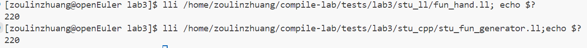

# lab3 实验报告

学号 202208040412 姓名 邹林壮

## 问题1: cpp 与 .ll 的对应

 assign_hand.ll与assign_generator.cpp

`assign_hand.ll`

```C++
; ModuleID = '/home/zoulinzhuang/compiler-lab-24fall/tests/lab3/ta_gcd/assign.c'
source_filename = "/home/zoulinzhuang/compiler-lab-24fall/tests/lab3/ta_gcd/assign.c"
target datalayout = "e-m:e-i8:8:32-i16:16:32-i64:64-i128:128-n32:64-S128"
target triple = "aarch64-unknown-linux-gnu"

; Function Attrs: noinline nounwind optnone uwtable
define dso_local i32 @main() #0 {
  %1 = alloca [10 x i32], align 4
  %2 = getelementptr inbounds [10 x i32], ptr %1, i64 0, i64 0
  store i32 10, ptr %2, align 4
  %3= load i32, ptr %2, align 4
  %4 = getelementptr inbounds [10 x i32], ptr %1, i64 0, i64 1
  %5 = mul nsw i32 %3, 2
  store i32 %5, ptr %4, align 4
  %6 = load i32, ptr %4, align 4
  ret i32 %5
}

attributes #0 = { noinline nounwind optnone uwtable "frame-pointer"="non-leaf" "no-trapping-math"="true" "stack-protector-buffer-size"="8" "target-cpu"="generic" "target-features"="+fp-armv8,+neon,+outline-atomics,+v8a,-fmv" }

!llvm.module.flags = !{!0, !1, !2, !3, !4}
!llvm.ident = !{!5}

!0 = !{i32 1, !"wchar_size", i32 4}
!1 = !{i32 8, !"PIC Level", i32 2}
!2 = !{i32 7, !"PIE Level", i32 2}
!3 = !{i32 7, !"uwtable", i32 2}
!4 = !{i32 7, !"frame-pointer", i32 1}
!5 = !{!"BiSheng Enterprise 4.0.0.B014 clang version 17.0.6 (0ac87bc45325)"}
```

`assign_generator.cpp`

```C++
#include "BasicBlock.h"
#include "Constant.h"
#include "Function.h"
#include "IRBuilder.h"
#include "Module.h"
#include "Type.h"

#include <iostream>
#include <memory>

#ifdef DEBUG  // 用于调试信息,大家可以在编译过程中通过" -DDEBUG"来开启这一选项
#define DEBUG_OUTPUT std::cout << __LINE__ << std::endl;  // 输出行号的简单示例
#else
#define DEBUG_OUTPUT
#endif

#define CONST_INT(num) \
    ConstantInt::get(num, module)

#define CONST_FP(num) \
    ConstantFP::get(num, module) // 得到常数值的表示,方便后面多次用到

int main() {
  auto module = new Module("assign code");  // 生成assign的代码
  auto builder = new IRBuilder(nullptr, module);
  Type *Int32Type = Type::get_int32_type(module);


    // BB的名字在生成中无所谓,但是可以方便阅读
  
    // main函数
  auto mainFun = Function::create(FunctionType::get(Int32Type, {}),
                                  "main", module);
  auto bb = BasicBlock::create(module, "entry", mainFun);                                
  
  // BasicBlock的名字在生成中无所谓,但是可以方便阅读
  builder->set_insert_point(bb);
  auto retAlloca = builder->create_alloca(Int32Type);

  auto *arrayType = ArrayType::get(Int32Type,10);
  auto a_array = builder->create_alloca(arrayType);
  auto aa = builder->create_gep(a_array,{CONST_INT(0),CONST_INT(0)});
  builder->create_store(CONST_INT(10),aa);
  auto a0load = builder->create_load(aa);
  auto a1data = builder->create_imul(a0load,CONST_INT(2));
  auto a1p = builder->create_gep(a_array,{CONST_INT(0),CONST_INT(1)});
  builder->create_store(a1data,a1p);
  auto a1load =builder->create_load(a1p);
  auto retp = builder->create_alloca(Int32Type);
  builder->create_store(a1load, retp); 
  auto retdata=builder->create_load(retp);
  builder->create_ret(retdata);

  std::cout<<module->print();
  delete module; 
  return 0;
}
```


fun_hand.ll与stu_fun_generator.ll

`fun_hand.ll`

```C++
; ModuleID = '/home/zoulinzhuang/compiler-lab-24fall/tests/lab3/ta_gcd/assign.c'
source_filename = "/home/zoulinzhuang/compiler-lab-24fall/tests/lab3/ta_gcd/assign.c"
target datalayout = "e-m:e-i8:8:32-i16:16:32-i64:64-i128:128-n32:64-S128"
target triple = "aarch64-unknown-linux-gnu"

; Function Attrs: noinline nounwind optnone uwtable
define dso_local i32 @callee(i32 noundef %0) #0 {
  %2 =alloca i32, align 4
  store i32 %0,ptr %2,align 4
  %3 = load i32,ptr %2,align 4 
  %4 = mul nsw i32 %3, 2
  
  ret i32 %4
}


; Function Attrs: noinline nounwind optnone uwtable
define dso_local i32 @main() #0 {
  %1 = alloca i32, align 4
  store i32 110, ptr %1, align 4
  %2 =load i32, ptr %1, align 4
  %3 = call i32 @callee(i32 noundef %2)
  ret i32 %3
}

attributes #0 = { noinline nounwind optnone uwtable "frame-pointer"="non-leaf" "no-trapping-math"="true" "stack-protector-buffer-size"="8" "target-cpu"="generic" "target-features"="+fp-armv8,+neon,+outline-atomics,+v8a,-fmv" }

!llvm.module.flags = !{!0, !1, !2, !3, !4}
!llvm.ident = !{!5}

!0 = !{i32 1, !"wchar_size", i32 4}
!1 = !{i32 8, !"PIC Level", i32 2}
!2 = !{i32 7, !"PIE Level", i32 2}
!3 = !{i32 7, !"uwtable", i32 2}
!4 = !{i32 7, !"frame-pointer", i32 1}
!5 = !{!"BiSheng Enterprise 4.0.0.B014 clang version 17.0.6 (0ac87bc45325)"}
```

`fun_generator.cpp`

```C++
#include "BasicBlock.h"
#include "Constant.h"
#include "Function.h"
#include "IRBuilder.h"
#include "Module.h"
#include "Type.h"

#include <iostream>
#include <memory>

#ifdef DEBUG  // 用于调试信息,大家可以在编译过程中通过" -DDEBUG"来开启这一选项
#define DEBUG_OUTPUT std::cout << __LINE__ << std::endl;  // 输出行号的简单示例
#else
#define DEBUG_OUTPUT
#endif

#define CONST_INT(num) \
    ConstantInt::get(num, module)

#define CONST_FP(num) \
    ConstantFP::get(num, module) // 得到常数值的表示,方便后面多次用到

int main() {
  auto module = new Module("fun code");  // 生成assign的代码
  auto builder = new IRBuilder(nullptr, module);
  Type *Int32Type = Type::get_int32_type(module);
  
  
  std::vector<Type *> Ints(1, Int32Type);
  auto callee_funtype=FunctionType::get(Int32Type,Ints);
  auto callee_fun=Function::create(FunctionType::get(Int32Type,{Int32Type}),"callee",module);
  auto bb =BasicBlock::create(module,"entry",callee_fun);
  builder->set_insert_point(bb);
  auto a_ca =builder->create_alloca(Int32Type);

  std::vector<Value *> args;  // 获取gcd函数的形参,通过Function中的iterator
  for (auto arg = callee_fun->arg_begin(); arg != callee_fun->arg_end(); arg++) {
    args.push_back(*arg);   // * 号运算符是从迭代器中取出迭代器当前指向的元素
  }
  builder->create_store(args[0],a_ca);
  auto aload=builder->create_load(a_ca);
  auto ans=builder->create_imul(CONST_INT(2),aload);
  auto retAlloca = builder->create_alloca(Int32Type);   // 在内存中分配返回值的位置
  builder->create_store(ans,retAlloca);
  auto retload=builder->create_load(retAlloca);
  builder->create_ret(retload);

  auto main_fun=Function::create(FunctionType::get(Int32Type,{ }),"main",module);
  auto bb1=BasicBlock::create(module,"main",main_fun);
  builder->set_insert_point(bb1);
  auto tmp=builder->create_alloca(Int32Type);
  builder->create_store(CONST_INT(110),tmp);
  auto tmpload=builder->create_load(tmp);
  auto res=builder->create_call(callee_fun,{tmpload});
  builder->create_ret(res);

  std::cout<<module->print();
  delete module;
  return 0;
    // BB的名字在生成中无所谓,但是可以方便阅读
}

```



if_hand.ll与if_generator.cpp

`if_hand.ll`

```C++
; ModuleID = '/home/zoulinzhuang/compiler-lab-24fall/tests/lab3/ta_gcd/assign.c'
source_filename = "/home/zoulinzhuang/compiler-lab-24fall/tests/lab3/ta_gcd/assign.c"
target datalayout = "e-m:e-i8:8:32-i16:16:32-i64:64-i128:128-n32:64-S128"
target triple = "aarch64-unknown-linux-gnu"

; Function Attrs: noinline nounwind optnone uwtable
define dso_local i32 @main() #0 {
  %1 = alloca float, align 4
  store float 0x40163851E0000000, ptr %1, align 4
  %2 = alloca i32 ,align 4
  store i32 233 ,ptr %2,align 4
  %3= alloca i32 ,align 4
  store i32 0 ,ptr %3,align 4
  %4= load float,ptr %1,align 4
  %5 = fcmp contract ogt float %4, 1.000000e+00
  br i1 %5,label %6,label %8

6:
  %7=load i32,ptr %2,align 4
  ret i32 %7 
  
8:
  %9=load i32,ptr %3,align 4
  ret i32 %9
}

attributes #0 = { noinline nounwind optnone uwtable "frame-pointer"="non-leaf" "no-trapping-math"="true" "stack-protector-buffer-size"="8" "target-cpu"="generic" "target-features"="+fp-armv8,+neon,+outline-atomics,+v8a,-fmv" }

!llvm.module.flags = !{!0, !1, !2, !3, !4}
!llvm.ident = !{!5}

!0 = !{i32 1, !"wchar_size", i32 4}
!1 = !{i32 8, !"PIC Level", i32 2}
!2 = !{i32 7, !"PIE Level", i32 2}
!3 = !{i32 7, !"uwtable", i32 2}
!4 = !{i32 7, !"frame-pointer", i32 1}
!5 = !{!"BiSheng Enterprise 4.0.0.B014 clang version 17.0.6 (0ac87bc45325)"}
```

`if_generator.cpp`

```C++
#include "BasicBlock.h"
#include "Constant.h"
#include "Function.h"
#include "IRBuilder.h"
#include "Module.h"
#include "Type.h"

#include <iostream>
#include <memory>

#ifdef DEBUG  // 用于调试信息,大家可以在编译过程中通过" -DDEBUG"来开启这一选项
#define DEBUG_OUTPUT std::cout << __LINE__ << std::endl;  // 输出行号的简单示例
#else
#define DEBUG_OUTPUT
#endif

#define CONST_INT(num) \
    ConstantInt::get(num, module)

#define CONST_FP(num) \
    ConstantFP::get(num, module) // 得到常数值的表示,方便后面多次用到

int main() {
  auto module = new Module("if code");  // 生成assign的代码
  auto builder = new IRBuilder(nullptr,module);
  Type* Int32Type = Type::get_int32_type(module);
  Type* floatType = Type::get_float_type(module);


    // BB的名字在生成中无所谓,但是可以方便阅读
  
    // main函数
  auto mainFun = Function::create(FunctionType::get(Int32Type, {}),
                                  "main", module);
  auto bb = BasicBlock::create(module, "entry", mainFun);                                
  
  // BasicBlock的名字在生成中无所谓,但是可以方便阅读
  builder->set_insert_point(bb);
  auto retAlloca = builder->create_alloca(Int32Type);
  auto ret_ca=builder->create_alloca(Int32Type);
  auto a_ca=builder->create_alloca(floatType);
  builder->create_store(CONST_FP(5.555),a_ca);
  auto aload=builder->create_load(a_ca);
  auto cmp=builder->create_fcmp_gt(aload,CONST_FP(1.000));
  auto true_bb=BasicBlock::create(module,"trueBB",mainFun);
  auto false_bb=BasicBlock::create(module,"false_BB",mainFun);
  auto ret_bb=BasicBlock::create(module,"retBB",mainFun);
  auto br=builder->create_cond_br(cmp,true_bb,false_bb);

  builder->set_insert_point(true_bb);
  builder->create_store(CONST_INT(233),ret_ca);
  builder->create_br(ret_bb);

  builder->set_insert_point(false_bb);
  builder->create_store(CONST_INT(0),ret_ca);
  builder->create_br(ret_bb);

  builder->set_insert_point(ret_bb);
  auto retload=builder->create_load(ret_ca);
  builder->create_ret(retload);

  std::cout<<module->print();
  delete module; 
  return 0;
}
```


`while_hand.ll`

```
; ModuleID = '/home/zoulinzhuang/compiler-lab-24fall/tests/lab3/ta_gcd/assign.c'
source_filename = "/home/zoulinzhuang/compiler-lab-24fall/tests/lab3/ta_gcd/assign.c"
target datalayout = "e-m:e-i8:8:32-i16:16:32-i64:64-i128:128-n32:64-S128"
target triple = "aarch64-unknown-linux-gnu"


; Function Attrs: noinline nounwind optnone uwtable
define dso_local i32 @main() #0 {

  %1 = alloca i32, align 4
  %2 = alloca i32, align 4
  store i32 10, ptr %1, align 4
  store i32 0, ptr %2, align 4
  br label %3
3:
  %4 = load i32, ptr %2, align 4
  %5 = icmp slt i32 %4, 10
  br i1 %5, label %6, label %10

6:
  %7 = load i32, ptr %1, align 4
  %8 = add nsw i32 %7, 1
  store i32 %8, ptr %1, align 4
  %9 = add nsw i32 %4, 1
  store i32 %9, ptr %2, align 4
  br label %3

10:
  %11 = load i32, ptr %1, align 4
  ret i32 %11
}

attributes #0 = { noinline nounwind optnone uwtable "frame-pointer"="non-leaf" "no-trapping-math"="true" "stack-protector-buffer-size"="8" "target-cpu"="generic" "target-features"="+fp-armv8,+neon,+outline-atomics,+v8a,-fmv" }

!llvm.module.flags = !{!0, !1, !2, !3, !4}
!llvm.ident = !{!5}

!0 = !{i32 1, !"wchar_size", i32 4}
!1 = !{i32 8, !"PIC Level", i32 2}
!2 = !{i32 7, !"PIE Level", i32 2}
!3 = !{i32 7, !"uwtable", i32 2}
!4 = !{i32 7, !"frame-pointer", i32 1}
!5 = !{!"BiSheng Enterprise 4.0.0.B014 clang version 17.0.6 (0ac87bc45325)"}
```

`stu_while_generate.ll`

```C++
#include "BasicBlock.h"
#include "Constant.h"
#include "Function.h"
#include "IRBuilder.h"
#include "Module.h"
#include "Type.h"

#include <iostream>
#include <memory>

#ifdef DEBUG  // 用于调试信息,大家可以在编译过程中通过" -DDEBUG"来开启这一选项
#define DEBUG_OUTPUT std::cout << __LINE__ << std::endl;  // 输出行号的简单示例
#else
#define DEBUG_OUTPUT
#endif

#define CONST_INT(num) \
    ConstantInt::get(num, module)

#define CONST_FP(num) \
    ConstantFP::get(num, module) // 得到常数值的表示,方便后面多次用到

int main() {
  auto module = new Module("while code");  // 生成assign的代码
  auto builder = new IRBuilder(nullptr,module);
  Type* Int32Type = Type::get_int32_type(module);

  
    // main函数
  auto mainFun = Function::create(FunctionType::get(Int32Type, {}),
                                  "main", module);
  auto bb = BasicBlock::create(module, "entry", mainFun);                                
  
  // BasicBlock的名字在生成中无所谓,但是可以方便阅读
  builder->set_insert_point(bb);
  auto retAlloca = builder->create_alloca(Int32Type);
  auto ret_ca=builder->create_alloca(Int32Type);
  auto a_ca=builder->create_alloca(Int32Type);
  builder->create_store(CONST_INT(10),a_ca);
  auto i_ca=builder->create_alloca(Int32Type);
  builder->create_store(CONST_INT(0),i_ca);
  
  //
  
  auto true_bb=BasicBlock::create(module,"true_bb",mainFun);
  auto false_bb=BasicBlock::create(module,"false_bb",mainFun);
  auto run_bb=BasicBlock::create(module,"run_bb",mainFun); 
  builder->create_br(run_bb);

  builder->set_insert_point(run_bb);
  auto iload=builder->create_load(i_ca);
  auto cmp=builder->create_icmp_lt(iload,CONST_INT(10));
  auto br=builder->create_cond_br(cmp,true_bb,false_bb);
  
  builder->set_insert_point(true_bb);
  auto aload=builder->create_load(a_ca);
  auto ans=builder->create_iadd(aload,CONST_INT(1));
  builder->create_store(ans,a_ca);
  auto res=builder->create_iadd(iload,CONST_INT(1));
  builder->create_store(res,i_ca);
  builder->create_br(run_bb);

  builder->set_insert_point(false_bb);
  auto retload=builder->create_load(a_ca);
  builder->create_ret(retload);

  std::cout<<module->print();
  delete module; 
  return 0;
}
```


## 问题2: Visitor Pattern

请指出visitor.cpp中，treeVisitor.visit(exprRoot)执行时，以下几个Node的遍历序列:numberA、numberB、exprC、exprD、exprE、numberF、exprRoot。
序列请按如下格式指明：
exprRoot->numberF->exprE->numberA->exprD

   

```C++
class TreeVisitorCalculator : public TreeVisitor {  // Implements triggering of all
                                                // kind of elements (nodes)
 public:
  int visit(AddSubNode& node) override {
    auto right = node.rightNode.accept(*this);
    auto left = node.leftNode.accept(*this);
    if (node.op == "add") {
      return left + right;
    } 
    else {
      return left - right;
    }
  }

  int visit(NumberNode& node) override {
    return node.number;
  }

  int visit(MulDivNode& node) override {
    auto left = node.leftNode.accept(*this);
    auto right = node.rightNode.accept(*this);
    if (node.op == "mul") {
      return left * right;
    } 
    else {
      return left / right;
    }
  }
};
```

对于AddSubNode，在visit函数中是先访问右子节点在访问左子节点

对于NumberNode，在visit函数中是直接访问对应数字的值

对于MulDivNode，在visit函数中是先访问左子节点再访问右子节点的。  

**观察构造表达式节点的代码：**
**观察构造表达式节点的代码：**

```
int main() {
  // construct the expression nodes and the tree
  // the expression: 4 * 2 - 2 / 4 + 5
  auto numberA = NumberNode(4);
  auto numberB = NumberNode(2);
  auto exprC = MulDivNode(numberA, numberB, "mul");
  auto exprD = MulDivNode(numberB, numberA, "div");
  auto exprE = AddSubNode(exprC, exprD, "sub");
  auto numberF = NumberNode(5);
  auto exprRoot = AddSubNode(exprE, numberF, "add");

  TreeVisitorCalculator treeVisitor;
  // traverse the tree and calculate
  int result = treeVisitor.visit(exprRoot);
  std::cout << "4 * 2 - 2 / 4 + 5 evaluates: " << result << std::endl;
  return 0;
}
```

**访问顺序**

根据上述分析的得知，访问顺序为：

$$exprRoot→numberF→experE→experD→numberB→numberA→experC→numberA→numberB$$


## 问题3: getelementptr


  请给出`IR.md`中提到的两种getelementptr用法的区别,并稍加解释:

- `%2 = getelementptr [10 x i32], [10 x i32]* %1, i32 0, i32 %0`
- `%2 = getelementptr i32, i32* %1 i32 %0`

1. 第一种方法，%1是我们的基址，两个索引0和%0。这是一个数组，但是getelementptr是需要通过指针访问它。第一个索引用于分割指针，第二个用于索引数组本身，对应于C语言取出a[0]的地址。
2. 第二种方法，%1是我们的基址，一个索引%0，也是对应于C语言取出a[0]的地址。

由上分析其实可以看出，这两种用法最后的得到的结果是相同的，只不过两种方法适用于不同的情况。第一种方法是[10 x i32]*类型，素以指针指向的地址内容认可以视为指针，所以需要多一重偏移得到数组的指针。这种方法使用与数组的寻址，也适用于结构体、向量等数据结构的寻址。

## 实验难点

1.在if_hand.ll文件中，对于语句float a = 5.555; 写成了store float 5.555,float*%1;编译错误，进行查阅资料得知，因为5.555转成二进制是无限循环的，而此编译器只接受精确的小数，所以换一种表达方式：

`store float 0x40163851E0000000,float*%1;`

getelementptr的理解比较困难，查阅了一些资料后进行解决。

## 实验反馈
1.该实验主要是进行了IR代码的生成，通过对IR代码的理解，可以更好的理解编译器的工作原理。
2.实验中涉及到的IR指令有alloca、load、store、br、cond_br、icmp、fcmp、add、sub、mul、div、ret等，通过对这些指令的理解，可以更好的理解编译器的工作原理。
3.通过手工构造IR代码，可以更好的理解IR代码的生成过程，对计算机系统和汇编代码有了更为深入的了解。