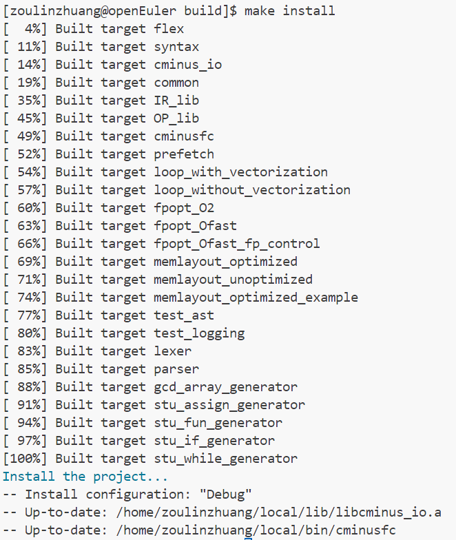
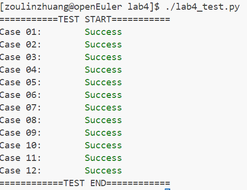
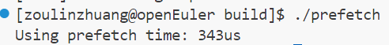

# Lab4 实验报告

姓名 邹林壮 学号 202208040412

## 实验要求

1.阅读cminus-f 的语义规则

2.阅读LightIR 核心类介绍

3.阅读实验框架，理解如何使用框架以及注意事项

4.修改 src/cminusfc/cminusf_builder.cpp 来实现自动 IR 产生的算法，使得它能正确编译任何合法的 cminus-f 程序

5.在 report.md 中解释设计，遇到的困难和解决方案

## 实验难点

**1.各个函数之间通过全局变量传递消息**

分析其中各个函数都是返回值类型为void类型的函数，所以需要设计额外的**全局变量**进行相关信息的传递。

这里全局变量的设计绝对是难点，这里和其他同学进行讨论，最终设置了三个全局变量。

比如赋值语句val = expression，expression进行过visit操作之后，需要使用一个额外的全局变量res将其值存储起来。

```
Value* res;
//ASTNum弄出来的值存在这里，因为所有函数的类型都是res的
Value *arg; //参数指针，表示参数列表 
bool if_return_notadd=false;//表示返回得到为地址还是返回值，用于后续判断
```

- `res`，针对的是`val = expression`等表达式，用于获得表达式的值
- `parm`，针对的是`ASTParam`，用于记录parm的值
- `if_return_notadd`,是针对于`ASTVal`节点，用于判断这个节点的编译后需不需要返回指针


**2.进行语义分析** 其中的语义检查过于繁琐，只处理了基本语义检查和一些常规语义检查。 并对其中的相关内容进行LOG输出，便于后续进行调试。

1. 当`if`语句和`while`语句的`endBB`基本块为空时翻译结果不符合语法规则
2. `if`语句和`while`语句的标号问题
3. `ASTVar`结点处理问题
4. 数组长度为0等相关情况

## 实验设计

### 如何设计全局变量与宏定义

> 全局变量的存在意义是将在下层才能取到的信息带回上层，或者将上层的状态信息传递给下层，一般来说有这样的需要就应该创建一个对应的全局变量，在我的实验中，有以下全局变量以及宏定义：
>
> - 设置一些宏用于方便代码实现，包括获取Int常量和Float常量，获取int32和Float这两种type，以及判断是不是整形、浮点型、指针
>
>   ```C++
>   #define CONST_INT(num) \
>       ConstantInt::get(num, module.get()) /* 增加一个有关整型的宏 */
>   #define CONST_FP(num) \
>       ConstantFP::get((float)num, module.get())
>   #define CONST_ZERO(var_type) \
>       ConstantZero::get(var_type, module.get())
>   #define TYPTRINT \
>       Type::get_int32_ptr_type(module.get())
>   #define TYPTRFLOAT \
>       Type::get_float_ptr_type(module.get())
>   #define TYVOID \
>       Type::get_void_type(module.get())
>   #define TYINT32 \
>       Type::get_int32_type(module.get())
>   #define TYFLOAT \
>       Type::get_float_type(module.get())
>   #define checkInt(num)\
>       num->get_type()->is_integer_type()
>   #define checkFloat(num) \
>       num->get_type()->is_float_type() /* 浮点型判断 */
>   #define checkPointer(num) \
>       num->get_type()->is_pointer_type() /* 指针类型判断 */
>   
>   Value* res;//ASTNum弄出来的值存在这里，因为所有函数的类型都是res的
>   Value *arg; //参数指针，表示参数列表 
>   bool if_return_notadd=false;//表示返回得到为地址还是返回值，用于后续判断
>   
>   ```
>
>   - `res`，针对的是`val = expression`等表达式，用于获得表达式的值
>   - `parm`，针对的是`ASTParam`，用于记录parm的值
>   - `if_return_notadd`,是针对于`ASTVal`节点，用于判断这个节点的编译后需不需要返回指针

### 遇到的难点以及解决方案

- 当`if`语句和`while`语句的`endBB`基本块为空时翻译结果不符合语法规则

  > 因为在函数中必须保证`endBB`或者其后继基本块中需要有`return`语句，故可以利用一个全局布尔变量`is_return`来记录语句中是否有`return`语句。
  >
  > - 在`if`情况下，再利用`if_is_return` 和`else_is_return` 来记录`if`语句和`else`语句中是否有`return`语句，如果`if`语句和`else`语句（如果存在`else`语句）中均有`return`语句，则说明无论如何都会`ret`，则可以在`endBB`中也要加入`return`语句来确保语法正确。
  > - 在`while`情况下，在`function declaration`的最后根据`is_return`的值来确定是否在返回，若没有返回值，则根据函数的类型添加`return`语句

- `if`语句和`while`语句的标号问题

  > 由于函数中可能出现多个if和while语句，故将需要将每次跳转的label区分开，有以下两种解决方案
  >
  > - 利用`sprintf`语句生成序号不同的`labelname`
  > - 直接讲`labelname`设置为空，翻译时会自动填充如不同的`label`

- `ASTVar`结点处理问题

  > 变量要区分是左值还是右值，通过全局枚举变量`lr`来记录该节点是左值还是右值，左值取变量地址，右值取变量的值。
  >
  > 通过`node.expression`判断参数是整型/浮点型还是数组类型。在处理右值时需要注意函数调用的`形参`在符号表均为指针类型（`node.expression`均为`nullptr`），故需要在整型/浮点型中需要特别处理形参是数组、指针的情况。
  >
  > 在处理`取了下标的数组变量`时，需要考虑数组下标是否合法，以及通过指针类型访问数组的情况。

- 数组下标报错问题

  > 数组下标如果是浮点数，调用`create_fptosi`接口转化为整型，再判断是否是负数，如果是负数需要调用`neg_idx_except()`，通过符号表得到该方法的地址然后使用接口`create_call`调用。

### 详细讲解每块内容

#### 1.`program->declaration-list`

确保数值常量被正确识别并转换为IR常量节点，为代码生成提供准确的数值表示，并在早期发现数据类型错误，避免后续编译问题

```C++
void CminusfBuilder::visit(ASTProgram &node) {
    LOG(DEBUG) << "Program\n";
    //语义检查
    if(node.declarations.size()==0){
        LOG(ERROR) << "程序缺少声明\n";
        return;
    }
    if(!(node.declarations.back()->id=="main"&&node.declarations.back()->type==TYPE_VOID))
{
    LOG(ERROR) << "程序最后一个声明不是void main(void)\n";
    return;
}
    for(auto decl : node.declarations){
        decl->accept(*this);//solve decl
    }

 }
```

- **日志记录**：使用`LOG(DEBUG)`宏记录程序结点的开始，便于调试和跟踪程序的执行流程。
- **语义检查**
  - 首先，函数检查`node.declarations`是否为空，即程序中是否有声明。如果没有声明，使用`LOG(ERROR)`记录错误信息，并返回。
  - 其次，函数检查程序的最后一个声明是否是`void main(void)`函数。这是Cminus-f语言的一个要求，即主函数必须以`void main(void)`的形式存在。如果不是，同样记录错误信息并返回。
- **遍历声明**：使用范围基于`for`循环遍历`node.declarations`中的所有声明。对于每个声明，调用`decl->accept(*this)`方法，这会根据声明的类型调用相应的`visit`函数进行处理。

####  2.`num`

```C++
void CminusfBuilder::visit(ASTNum &node) { 
    LOG(DEBUG) << "Num\n";
    if(node.type==TYPE_INT)
    res=ConstantInt::get(node.i_val,module.get());
    else if(node.type==TYPE_FLOAT)
    res=ConstantFP::get(node.f_val,module.get());
    else LOG(ERROR) <<"缺少num\n";
}
```

- **日志记录**：
  - `LOG(DEBUG)`宏记录处理数值常量节点的开始，便于调试和跟踪编译过程。
- **数值类型处理**：
  - 检查数值常量的类型，决定创建整数还是浮点数常量。
  - 若`node.type`为`TYPE_INT`，则调用`ConstantInt::get`创建整数常量节点，结果存储在`res`。
  - 若`node.type`为`TYPE_FLOAT`，则调用`ConstantFP::get`创建浮点数常量节点，结果存储在`res`。
- **错误处理**：
  - 若数值常量的类型既非整数也非浮点数，记录错误信息，指出缺少有效的数值类型。

#### 3.`var-declaration -> type-specifier ID | type-specifier ID [INTEGER]`

```C++
void CminusfBuilder::visit(ASTVarDeclaration &node) {
    LOG(DEBUG)<<"var-declration\n";
    Type *tmp;//类型指针
    if(node.type==TYPE_INT)tmp=TYINT32;
    else if(node.type==TYPE_FLOAT)tmp=TYFLOAT;
    else LOG(ERROR)<<"变量声明中只有整型和浮点型可以使用\n";
    //通过判断其是否具有num，区分为数组和非数组
    if(node.num!=nullptr){
        if(node.num->i_val<=0)LOG(ERROR)<<"数组长度必须大于0\n";
        auto *arrayType=ArrayType::get(tmp,node.num->i_val);//根据数组长度得到类型
        auto init=CONST_ZERO(tmp);//全局变量初始化为0
        Value *arrayAlloca;//存储申请到的数组的地址
        if(scope.in_global())arrayAlloca=GlobalVariable::create(node.id,module.get(),arrayType,false,init);
        else arrayAlloca=builder->create_alloca(arrayType);
        scope.push(node.id,arrayAlloca);//将获得的数组变量加入域
    }
    else{
        auto init=CONST_ZERO(tmp);
        Value *varAlloca;//存储申请到的变量的地址
        if(scope.in_global())varAlloca=GlobalVariable::create(node.id,module.get(),tmp,false,init);
        else varAlloca=builder->create_alloca(tmp);
        scope.push(node.id,varAlloca);//将获得的变量加入域
    }

 }
```

- **日志记录**：
  - 使用`LOG(DEBUG)`记录函数的调用，便于调试。
- **类型检查**：
  - 根据节点的类型指定变量的类型，整型对应`TYINT32`，浮点型对应`TYFLOAT`。
  - 如果类型既不是整型也不是浮点型，则记录错误。
- **数组与非数组声明**：
  - 检查是否声明了数组（通过`node.num`是否存在来判断）。
  - 对于数组声明：
    - 验证数组长度是否合法（大于0）。
    - 创建数组类型，并初始化为零。
    - 根据是否为全局变量，创建全局或局部存储空间。
    - 将数组变量添加到作用域。
  - 对于非数组声明：
    - 初始化变量为零。
    - 根据是否为全局变量，创建全局或局部存储空间。
    - 将变量添加到作用域。

#### 4.`fun-declaration—>type-specifier ID ( params ) compound-stmt`

```C++
//fun-declaration—>type-specifier ID ( params ) compound-stmt
void CminusfBuilder::visit(ASTFunDeclaration &node) { 
    LOG(DEBUG) <<"fun-declaration\n";
    Type *retType;//设定返回值类型
    if(node.type==TYPE_INT)retType=TYINT32;
    else if(node.type==TYPE_FLOAT)retType=TYFLOAT;
    else if(node.type==TYPE_VOID)retType=TYVOID;
    else LOG(ERROR)<<"函数返回类型只能为int,float,void";

    //根据函数声明，构造形参类型列表
    std::vector<Type *>paramsType;
    for(auto param:node.params){
        if(param->isarray){
            if(param->type==TYPE_INT)paramsType.push_back(TYPTRINT);
            else paramsType.push_back(TYPTRFLOAT);
        }else{
            if(param->type==TYPE_INT)paramsType.push_back(TYINT32);
            else paramsType.push_back(TYFLOAT);
        }
    }
    auto funType =FunctionType::get(retType,paramsType);//retType返回结构
    auto function=Function::create(funType,node.id,module.get());//创建函数
    scope.push(node.id,function);
    scope.enter();
    auto bb=BasicBlock::create(module.get(),node.id+"_entry",function);//创建基本块
    builder->set_insert_point(bb);

    std::vector<Value *> args;//创建vector存储实参
    for(auto arg=function->arg_begin();arg != function->arg_end(); arg++)args.push_back(*arg);

    for (int i = 0; i < node.params.size(); i++)
    {                                /* 遍历形参列表 */
        auto param = node.params[i]; /* 取出对应形参 */
        arg = args[i];               /* 取出对应实参 */
        param->accept(*this);        /* 调用param的accept进行处理 */
    }
        node.compound_stmt->accept(*this); /* 处理函数体内语句compound-stmt */
    // 判断返回值的类型，根据对应的返回值类型，执行ret操作
    
    if (builder->get_insert_block()->get_terminator() == nullptr)//判断是否没有显式返回
    {
        if (function->get_return_type()->is_void_type())// 若没有显式返回，默认返回对应类型的0或void
            builder->create_void_ret();
        else if (function->get_return_type()->is_float_type())
            builder->create_ret(CONST_FP(0.0));
        else
            builder->create_ret(CONST_INT(0));
    }
    scope.exit(); //退出此函数作用域 

}
```

- **日志记录**：
  - 使用`LOG(DEBUG)`记录函数声明节点的处理开始。
- **返回值类型设置**：
  - 根据函数的返回类型（`node.type`），设置返回值类型为`TYINT32`（整型）、`TYFLOAT`（浮点型）或`TYVOID`（无返回值）。
  - 如果返回类型不是这三种之一，记录错误信息。
- **构造形参类型列表**：
  - 遍历函数的参数列表，根据每个参数是否为数组以及其类型，构造形参类型列表。
  - 数组参数的类型设置为指针类型（`TYPTRINT`或`TYPTRFLOAT`），非数组参数的类型设置为基本类型（`TYINT32`或`TYFLOAT`）。
- **创建函数**：
  - 使用`FunctionType::get`根据返回值类型和形参类型列表创建函数类型。
  - 使用`Function::create`创建函数实例，并将其添加到作用域中。
- **设置插入点**：
  - 创建一个新的基本块（`BasicBlock`）作为函数的入口点，并设置构建器的插入点到这个基本块。
- **处理形参**：
  - 遍历函数的形参和实参，对每个形参调用`accept`方法进行进一步处理。
- **处理函数体**：
  - 对函数体中的复合语句（`compound-stmt`）调用`accept`方法进行处理。
- **默认返回值处理**：
  - 如果函数没有显式的返回语句，根据函数的返回类型，添加默认的返回语句：
    - 无返回值的函数添加`create_void_ret`。
    - 浮点型返回值的函数添加`create_ret(CONST_FP(0.0))`。
    - 整型返回值的函数添加`create_ret(CONST_INT(0))`。
- **退出函数作用域**：
  - 处理完函数声明后，退出函数作用域。

#### 5.`param→type-specifier ID | type-specifier ID []`

参数的存储空间分配、值的存储以及作用域的管理，为编译器的后续代码生成和语义分析提供了必要的参数信息

```C++
//param→type-specifier ID | type-specifier ID []
void CminusfBuilder::visit(ASTParam &node) { 
    LOG(DEBUG) <<"Param\n";

    Value *paramAlloca;//分配参数的存储空间
    if(node.isarray){//如果是数组
        if(node.type==TYPE_INT)paramAlloca=builder->create_alloca(TYPTRINT);
        else if(node.type==TYPE_FLOAT)paramAlloca=builder->create_alloca(TYPTRFLOAT);
    }else {//如果不是数组
        if(node.type==TYPE_INT)paramAlloca=builder->create_alloca(TYINT32);
        else if(node.type==TYPE_FLOAT)paramAlloca=builder->create_alloca(TYFLOAT);
    }

    builder->create_store(arg,paramAlloca);//arg通过全局变量传递
    scope.push(node.id,paramAlloca);//将参数压入域中
}
```

- **日志记录**：
  - 使用`LOG(DEBUG)`记录函数参数节点的处理开始。
- **参数存储空间分配**：
  - 根据参数是否为数组以及其类型，分配相应的存储空间。
  - 如果参数是数组，分配一个指向整数或浮点数的指针类型的存储空间。
  - 如果参数不是数组，直接分配一个整数或浮点数类型的存储空间。
- **参数值存储**：
  - 使用`builder->create_store(arg, paramAlloca)`将实参的值存储到分配的参数存储空间中，其中`arg`是通过全局变量传递的实参。
- **参数加入作用域**：
  - 使用`scope.push(node.id, paramAlloca)`将参数的标识符和其存储空间的地址压入作用域中，以便在函数体内可以访问和使用这些参数。

#### 6.`compound-stmt→{ local-declarations statement-list}`

确保复合语句内的所有局部声明和语句被正确处理，并且维护作用域的正确性。

```C++
//compound-stmt→{ local-declarations statement-list}
void CminusfBuilder::visit(ASTCompoundStmt &node) { 
    LOG(DEBUG)<<"CompoundStmt\n";
    scope.enter();
    for(auto local : node.local_declarations)local->accept(*this);
    for(auto statement : node.statement_list)statement->accept(*this);
    scope.exit();

}
```

- **日志记录**：
  - 使用`LOG(DEBUG)`记录复合语句节点的处理开始，有助于调试和跟踪编译过程。
- **进入新作用域**：
  - 调用`scope.enter()`进入一个新的作用域。这是因为复合语句通常定义了自己的局部变量，这些变量应该只在复合语句内部可见。
- **处理局部声明**：
  - 遍历`node.local_declarations`中的所有局部变量声明，并调用它们的`accept`方法。这会触发对每个局部变量声明的处理，例如为其分配存储空间并将其添加到当前作用域。
- **处理语句列表**：
  - 遍历`node.statement_list`中的所有语句，并调用它们的`accept`方法。这会根据语句的类型调用相应的`visit`函数进行处理，例如处理变量赋值、函数调用等。
- **退出作用域**：
  - 处理完复合语句内的所有声明和语句后，调用`scope.exit()`退出当前作用域。这表示复合语句结束，与之相关联的局部变量将不再可见。

#### 7.`expression-stmt→expression ; | ;`

```C++
//expression-stmt→expression ; | ;
void CminusfBuilder::visit(ASTExpressionStmt &node) { 
    LOG(DEBUG)<<"Expreesionstmt\n";
    if(node.expression!=nullptr)node.expression->accept(*this);//如果表达式不为空，说明其存在，处理
}
```

- **日志记录**：
  - 使用`LOG(DEBUG)`记录表达式语句节点的处理开始，这有助于调试和跟踪编译过程。
- **表达式处理**：
  - 检查`node.expression`是否不为`nullptr`，即判断是否有表达式存在。
  - 如果表达式存在，调用`node.expression->accept(*this)`处理该表达式。这会根据表达式的类型调用相应的`visit`函数，执行表达式的语义分析和中间代码生成。

#### 8.`selection-stmt→ if ( expression ) statement| if ( expression ) statement else statement`

确保`if`和`if-else`语句被正确处理，包括条件表达式的求值、条件跳转、以及`if`和`else`块的执行，正确地处理条件控制流,便于后续数据流的优化

```C++
//selection-stmt→ if ( expression ) statement| if ( expression ) statement else statement
void CminusfBuilder::visit(ASTSelectionStmt &node) {
    LOG(DEBUG)<<"selection-stmt";
    node.expression->accept(*this);//solve statement
    auto resType=res->get_type();//selection-stmt type
    if(resType->is_pointer_type())res=builder->create_load(res);
    else if(resType->is_integer_type())res=builder->create_icmp_gt(res,CONST_ZERO(TYINT32));
    else if(resType->is_float_type())res=builder->create_fcmp_gt(res,CONST_ZERO(TYFLOAT));
    
    auto function=builder->get_insert_block()->get_parent();
    auto trueBB=BasicBlock::create(module.get(),"true",function);//构造truebb
    
    if(node.else_statement!=nullptr){
        auto falseBB=BasicBlock::create(module.get(),"false",function);//存在else构造falsebb
        builder->create_cond_br(res,trueBB,falseBB);

        builder->set_insert_point(trueBB);//符合if
        node.if_statement->accept(*this);//处理else
        auto tbb=builder->get_insert_block();//将块加入

        builder->set_insert_point(falseBB);//符合else
        node.else_statement->accept(*this);
        auto fbb=builder->get_insert_block();

        auto tTerm=builder->get_insert_block()->get_terminator();//判断true是否存在ret
        auto fTerm=builder->get_insert_block()->get_terminator();//判断false是否存在ret

        if(tTerm==nullptr||fTerm==nullptr){//如果不存在ret
            BasicBlock *retBB;
            retBB=BasicBlock::create(module.get(),"retbb",function);
            builder->set_insert_point(retBB);
            if(tTerm==nullptr)builder->set_insert_point(trueBB);
            else if(fTerm==nullptr)builder->set_insert_point(falseBB);
            builder->create_br(retBB);
        }


    }else{//不存在else
            auto retBB=BasicBlock::create(module.get(),"ret",function);
            builder->create_cond_br(res,trueBB,retBB);//设置跳转
            builder->set_insert_point(trueBB);
            node.if_statement->accept(*this);//条件符合执行
            if(builder->get_insert_block()->get_terminator()==nullptr)builder->create_br(retBB);//补充return
            builder->set_insert_point(retBB);//后续return

        }


 }
```

- **日志记录**：
  - 使用`LOG(DEBUG)`记录条件选择语句节点的处理开始，有助于调试和跟踪编译过程。
- **表达式求值**：
  - 调用`node.expression->accept(*this)`处理`if`语句的条件表达式，结果存储在`res`中。
- **结果类型处理**：
  - 根据`res`的类型，进行不同的处理：
    - 如果是指针类型，使用`create_load`加载其指向的值。
    - 如果是整数类型，使用`create_icmp_gt`与0比较。
    - 如果是浮点类型，使用`create_fcmp_gt`与0比较。
- **基本块创建**：
  - 创建`trueBB`基本块，用于条件为真时的代码。
  - 如果存在`else`语句，创建`falseBB`基本块，用于条件为假时的代码。
- **条件跳转**：
  - 使用`create_cond_br`根据条件表达式的结果进行条件跳转。
- **`if`语句处理**：
  - 设置插入点到`trueBB`，处理`if`语句的主体。
  - 如果`if`语句块中没有终止指令（如`return`），则创建一个跳转到`retBB`的无条件跳转指令。
- **`else`语句处理**（如果存在）：
  - 设置插入点到`falseBB`，处理`else`语句的主体。
  - 如果`else`语句块中没有终止指令，同样创建一个跳转到`retBB`的无条件跳转指令。
- **统一返回处理**：
  - 如果`if`或`else`块中没有返回语句，创建一个`retBB`基本块，并在每个块的末尾添加跳转到`retBB`的指令。
- **结束处理**：
  - 设置插入点到`retBB`，作为后续代码的继续点。

#### 9.`iteration-stmt→while ( expression ) statement`

负责循环语句（即`while`循环）,包括条件判断、循环体执行以及循环的退出

```C++
//iteration-stmt→while ( expression ) statement
void CminusfBuilder::visit(ASTIterationStmt &node) {
    LOG(DEBUG)<<"iteration-stmt";
    auto function=builder->get_insert_block()->get_parent();//获得当前块对应的函数
    auto conBB=BasicBlock::create(module.get(),"condition",function);
    auto loopBB=BasicBlock::create(module.get(),"loop",function);
    auto retBB=BasicBlock::create(module.get(),"ret",function);
    if(builder->get_insert_block()->get_terminator()==nullptr)builder->create_br(conBB);//跳转至条件判断块
    
    builder->set_insert_point(conBB);//构建条件判断块
    node.expression->accept(*this);//处理表达式，结果存到expression
    auto resType=res->get_type();//表达式结果类型
    if(resType->is_pointer_type())res=builder->create_load(res);
    else if(resType->is_integer_type())res=builder->create_icmp_gt(res,CONST_ZERO(TYINT32));
    else if(resType->is_float_type())res=builder->create_fcmp_gt(res,CONST_ZERO(TYFLOAT));
    builder->create_cond_br(res,loopBB,retBB);//条件跳转

    //loop
    builder->set_insert_point(loopBB);
    node.statement->accept(*this);
    if(builder->get_insert_block()->get_terminator()==nullptr)builder->create_br(conBB);
    
    builder->set_insert_point(retBB);//return 块
 }
```

- **日志记录**：
  - 使用`LOG(DEBUG)`记录循环语句节点的处理开始，有助于调试和跟踪编译过程。
- **基本块创建**：
  - 创建三个基本块：`conBB`用于条件判断，`loopBB`用于循环体，`retBB`用于循环结束后的退出点。
- **初始跳转**：
  - 如果当前基本块没有终止指令，添加一个无条件跳转到条件判断块`conBB`的指令。
- **条件判断**：
  - 设置插入点到`conBB`。
  - 处理`while`循环的条件表达式，并根据其类型进行适当的比较操作，结果存储在`res`中。
  - 根据`res`的值进行条件跳转：如果为真，跳转到循环体`loopBB`；如果为假，跳转到退出块`retBB`。
- **循环体执行**：
  - 设置插入点到`loopBB`。
  - 处理循环体内的语句。
- **循环继续**：
  - 如果循环体结束后没有终止指令，添加一个无条件跳转回条件判断块`conBB`的指令，以继续循环。
- **退出循环**：
  - 设置插入点到`retBB`，作为循环结束后的代码继续执行的点。

#### 10.`return-stmt→return ; | return expression`

```C++
//return-stmt→return ; | return expression
void CminusfBuilder::visit(ASTReturnStmt &node) {
    LOG(DEBUG)<<"return-stmt";
    auto function = builder->get_insert_block()->get_parent(); //得到函数所在范围
    auto retType = function->get_return_type();//得到函数return的类型
    if (retType->is_void_type())//若返回值为void
    {
        builder->create_void_ret(); //构建void返回值
        return;//直接返回
    }                

    //非空
    node.expression->accept(*this); //处理expression条件判断对应的表达式
    auto resType = res->get_type(); //获取表达式得到的结果类型 
    // 处理expression返回的结果
    
    
    if (retType->is_integer_type() && resType->is_float_type()){res = builder->create_fptosi(res, TYINT32);LOG(WARNING) << "强制类型转换 float转int，返回值需要与定义一致";}    
    if (retType->is_float_type() && resType->is_integer_type()){res = builder->create_sitofp(res, TYINT32);LOG(WARNING) << "强制类型转换 int转float，返回值需要与定义一致";}
        
     //创建return，将expression的结果进行返回 
    builder->create_ret(res);
 }
```

- **日志记录**：
  - 使用`LOG(DEBUG)`记录`return`语句节点的处理开始，有助于调试和跟踪编译过程。
- **获取函数返回类型**：
  - 通过`builder->get_insert_block()->get_parent()`获取当前正在处理的函数。
  - 通过`function->get_return_type()`获取该函数的返回类型。
- **处理void返回类型**：
  - 如果函数的返回类型为`void`，则直接创建一个`void`返回指令`builder->create_void_ret()`并结束函数处理。
- **处理非void返回类型**：
  - 如果`return`语句带有表达式，调用`node.expression->accept(*this)`处理该表达式，并将结果存储在`res`中。
  - 获取表达式的结果类型`resType`。
- **类型转换**：
  - 如果函数期望的返回类型是整数，但表达式结果是浮点数，则将浮点数强制转换为整数。
  - 如果函数期望的返回类型是浮点数，但表达式结果是整数，则将整数强制转换为浮点数。
  - 在进行类型转换时，记录警告日志，提示类型不匹配。
- **创建返回指令**：
  - 使用`builder->create_ret(res)`创建返回指令，将表达式的结果作为返回值。

#### 11.`var→ID | ID [expression]`

确保变量和数组元素的访问被正确处理，包括索引的合法性检查、类型转换和地址或值的获取，能够正确地处理变量访问和数组索引，为生成正确的中间表示代码提供基础。

```C++
//var→ID | ID [expression]
void CminusfBuilder::visit(ASTVar &node) {
    LOG(DEBUG)<<"var\n";
    auto var = scope.find(node.id);      //从域中取出对应变量 ID
    bool if_return_lvalue = if_return_notadd; // 判断是否需要返回地址
    if_return_notadd = false;                 // 重置

    Value *index = CONST_INT(0);         //init index for array
    if (node.expression != nullptr)//带有表达式,为数组
    {                                                     
        node.expression->accept(*this);                   // 处理expression，得到res 
        auto res1 = res;                                   // 存储结果 
        if (checkFloat(res1)){res1 = builder->create_fptosi(res1, TYINT32); LOG(WARNING)<<"下标应为整数，float改为int";}// 若是浮点数，则矫正为整数                               
            
        index = res1;                                      //表示数组下标
        // 判断下标是否为负数
        auto function = builder->get_insert_block()->get_parent();                    // 获取当前函数
        auto indexTest = builder->create_icmp_lt(index, CONST_ZERO(TYINT32));          // 测试index是否为负数 
        auto failBB = BasicBlock::create(module.get(), node.id + "_failTest", function); // 创建fail块 
        auto passBB = BasicBlock::create(module.get(), node.id + "_passTest", function); // 创建pass块 
        builder->create_cond_br(indexTest, failBB, passBB);                              // 如果为负，则跳转到fail块 

        // 下标为负数，调用neg_idx_except函数进行处理
        // 一个负的下标会导致程序终止，需要调用框架中的内置函数`neg_idx_except` （该内部函数会主动退出程序，只需要调用该函数即可），但是对于上界并不做检查。
        builder->set_insert_point(failBB);                       // fail块，即下标为负数 
        auto fail = scope.find("neg_idx_except");                // 取出neg_idx_except函数 
        builder->create_call(static_cast<Function *>(fail), {}); // 调用neg_idx_except函数进行处理 
        builder->create_br(passBB);                              // 跳转到pass块 

        // 下标合法
        builder->set_insert_point(passBB);                                // pass块 
        if (var->get_type()->get_pointer_element_type()->is_array_type()) // 若为指向数组的指针 
            var = builder->create_gep(var, {CONST_INT(0), index});        // 得到对应数组元素的指针，即指向元素 
        else
        {
            if (var->get_type()->get_pointer_element_type()->is_pointer_type()) // 若为指针 
                var = builder->create_load(var);                                // 则取出指针指向的元素 
            var = builder->create_gep(var, {index});                            // 得到对应元素的指针 
        }
        //expression中有内容
        if (if_return_lvalue) // 若要返回值 
        {                            
            res = var;               // 则返回var对应的地址 
            if_return_notadd = false; 
        }
        else res = builder->create_load(var); // 否则则进行load
        return;
    }
    else{ // 处理不是数组的情况 var->ID
        if (if_return_lvalue)
        {                             
            res = var;              // 若要返回值,则返回var对应的地址  
            if_return_notadd = false;     //重置
        }
        else
        {   // 数组的指针即a[]类型就返回数组的起始地址，否则load取值
            if (var->get_type()->get_pointer_element_type()->is_array_type()) // 若指向数组，需要两个偏移取地址 
                res = builder->create_gep(var, {CONST_INT(0), CONST_INT(0)}); //寻址，找到对应数组的首地址
            else
                res = builder->create_load(var); // 否则则是普通指针，直接进行load获得其指向元素 
        }
    }
}
```

- **日志记录**：
  - 使用`LOG(DEBUG)`记录变量节点的处理开始，有助于调试和跟踪编译过程。
- **变量查找**：
  - 通过`scope.find(node.id)`从当前作用域中查找变量的存储位置。
- **地址返回标记**：
  - `if_return_lvalue`标记指示是否需要返回变量的地址而不是值。
- **数组索引处理**：
  - 如果`node.expression`不为空，表示访问的是数组元素。
  - 处理数组索引表达式，并将其结果存储在`res1`中。
  - 如果索引是浮点数，则将其转换为整数索引。
- **负索引检查**：
  - 创建两个基本块`failBB`和`passBB`，用于处理数组索引是否为负数的情况。
  - 如果索引为负数，调用`neg_idx_except`函数处理异常，并跳转到`passBB`。
- **数组元素访问**：
  - 如果变量是指向数组的指针，使用`create_gep`获取数组元素的指针。
  - 如果变量是指针，先加载其指向的值，然后使用`create_gep`获取元素的指针。
- **返回值处理**：
  - 如果`if_return_lvalue`为真，返回变量的地址。
  - 否则，如果访问的是数组，获取数组的起始地址或加载指针指向的值。
- **非数组变量处理**：
  - 如果`node.expression`为空，表示访问的是普通变量。
  - 根据`if_return_lvalue`标记返回变量的地址或加载其值。

#### 12.`var = expression` 赋值语句

```C++
//var = expression 赋值语句
void CminusfBuilder::visit(ASTAssignExpression &node) {
    LOG(DEBUG) << "AssignExpression\n";
    if_return_notadd = true; //表示需要返回值 
    
    // 获取左值，右值
    node.var->accept(*this);        // 处理var 
    auto left = res;                // left为左侧地址 
    node.expression->accept(*this); // 处理右侧expression 
    auto right = res;               // 获得右侧结果 

    // 处理左值，右值类型冲突问题
    auto leftType = left->get_type()->get_pointer_element_type(); // 获取var的类型
    /* 若赋值语句左右类型不匹配，则进行匹配 */
    if (leftType == TYFLOAT && checkInt(right)){right = builder->create_sitofp(right, TYFLOAT);LOG(WARNING)<<"赋值语句左右类型不匹配，右侧改为float";}
    if (leftType == TYINT32 && checkFloat(right)){right = builder->create_fptosi(right, TYINT32);LOG(WARNING)<<"赋值语句左右类型不匹配，右侧改为int";}
    // 赋值
    builder->create_store(right, left);
 }
```

- **日志记录**：
  - 使用`LOG(DEBUG)`记录赋值表达式节点的处理开始，有助于调试和跟踪编译过程。
- **标记返回值需求**：
  - 设置`if_return_notadd`为`true`，表示这个赋值表达式需要返回值。
- **处理左侧变量**：
  - 调用`node.var->accept(*this)`处理赋值语句左侧的变量，获取其地址，并将其存储在`left`中。
- **处理右侧表达式**：
  - 调用`node.expression->accept(*this)`处理赋值语句右侧的表达式，获取其结果，并将其存储在`right`中。
- **类型检查与转换**：
  - 获取左侧变量的类型`leftType`。
  - 如果左侧是浮点类型而右侧是整数类型，则将右侧转换为浮点类型，并记录警告日志。
  - 如果左侧是整数类型而右侧是浮点类型，则将右侧转换为整数类型，并记录警告日志。
- **执行赋值**：
  - 使用`builder->create_store(right, left)`将右侧的值存储到左侧变量的地址中，完成赋值操作。

#### 13.`simple-expression→additive-expression relop additive-expression | additive-expression`

```C++
//simple-expression→additive-expression relop additive-expression | additive-expression
void CminusfBuilder::visit(ASTSimpleExpression &node) {
    LOG(DEBUG) << "SimpleExpression\n";
    node.additive_expression_l->accept(*this); // 处理左边的expression 
    auto lres = res;                           // 获取结果存到lres中 
    if (node.additive_expression_r == nullptr)// 若不存在右expression，则直接返回
    {
        return;
    }                                           
    node.additive_expression_r->accept(*this); // 处理右边的expression 
    auto rres = res;                           // 结果存到rres中 

    // 需要确保两个表达式的类型相同，
    //若存在浮点和整型混存，全部转换为浮点型
    
    if (checkInt(lres) && checkInt(rres))//两边都是整数则进行int型操作 
    { 
        switch (node.op)//根据op构建代码
        {
        //调用icmp进行处理
        // 比较的返回结果
        // ast.hh中enum RelOp：
        // <= 对应 OP_LE,
        // < 对应 OP_LT,
        // > 对应 OP_GT,
        // >= 对应 OP_GE,
        // == 对应 OP_EQ,
        // != 对应 OP_NEQ
        case OP_LE:
            res = builder->create_icmp_le(lres, rres);
            break;
        case OP_LT:
            res = builder->create_icmp_lt(lres, rres);
            break;
        case OP_GT:
            res = builder->create_icmp_gt(lres, rres);
            break;
        case OP_GE:
            res = builder->create_icmp_ge(lres, rres);
            break;
        case OP_EQ:
            res = builder->create_icmp_eq(lres, rres);
            break;
        case OP_NEQ:
            res = builder->create_icmp_ne(lres, rres);
            break;
        }
    }
    else
    {   LOG(WARNING)<<"表达式类型不匹配，强制转换为float";                    
            // 存在浮点类型，若存在其中一个为int型，需要将其转为浮点数，再进行比较 
        if (checkInt(lres)) // 若左边是整数，则将其转为浮点数 
            lres = builder->create_sitofp(lres, TYFLOAT);
        if (checkInt(rres)) // 若右边是整数，则将其转为浮点数 
            rres = builder->create_sitofp(rres, TYFLOAT);
        switch (node.op)
        {
        /* 根据不同的比较操作，调用fcmp进行处理 */
        case OP_LE:
            res = builder->create_fcmp_le(lres, rres);
            break;
        case OP_LT:
            res = builder->create_fcmp_lt(lres, rres);
            break;
        case OP_GT:
            res = builder->create_fcmp_gt(lres, rres);
            break;
        case OP_GE:
            res = builder->create_fcmp_ge(lres, rres);
            break;
        case OP_EQ:
            res = builder->create_fcmp_eq(lres, rres);
            break;
        case OP_NEQ:
            res = builder->create_fcmp_ne(lres, rres);
            break;
        }
    }


    res = builder->create_zext(res, TYINT32); // 将得到的结果作为整数保存（可作为判断语句中的判断条件）
 }
```

- **日志记录**：
  - 使用`LOG(DEBUG)`记录简单表达式节点的处理开始，有助于调试和跟踪编译过程。
- **处理左侧表达式**：
  - 调用`node.additive_expression_l->accept(*this)`处理左侧的表达式，并将结果存储在`lres`中。
- **处理右侧表达式（如果存在）**：
  - 检查右侧表达式是否存在，如果存在，调用`node.additive_expression_r->accept(*this)`处理右侧的表达式，并将结果存储在`rres`中。
- **类型统一**：
  - 确保两个表达式的类型相同。如果存在类型不匹配，将整型转换为浮点型，以便进行比较。
- **整数类型比较**：
  - 如果两个表达式的结果都是整数类型，根据关系运算符`node.op`的类型，使用`create_icmp_*`方法生成相应的整数比较指令。
- **浮点类型比较**：
  - 如果至少有一个表达式的结果不是整数类型，将所有整数转换为浮点型，然后根据关系运算符`node.op`的类型，使用`create_fcmp_*`方法生成相应的浮点比较指令。
- **结果扩展**：
  - 最后，使用`create_zext`将比较结果扩展为`TYINT32`类型，以便作为判断语句中的判断条件。

#### 14.`additive-expression→additive-expression addop term | term`

确保加法和减法表达式被正确处理，包括类型检查、类型转换和生成相应的算术指令

```C++
//additive-expression→additive-expression addop term | term
void CminusfBuilder::visit(ASTAdditiveExpression &node) {    
    LOG(DEBUG) << "AdditiveExpression\n";
    if (node.additive_expression == nullptr)
    { // 若无加减法运算 
        node.term->accept(*this);
        return; // 则做乘除法 
    }

    node.additive_expression->accept(*this); // 处理左expression 
    auto lres = res;                         // 结果保存在lres中 
    node.term->accept(*this);                // 处理右term 
    auto rres = res;                         // 结果保存在rres中 

    // 分为整型-整型，和存在浮点数类型，这两种情况进行讨论
    // 若存在浮点数，则全部强制转换为浮点数实现
    if (checkInt(lres) && checkInt(rres))
    { //all int
        switch (node.op)
        { /* 根据对应加法或是减法，调用iadd或是isub进行处理 */
        case OP_PLUS:
            res = builder->create_iadd(lres, rres);
            break;
        case OP_MINUS:
            res = builder->create_isub(lres, rres);
            break;
        }
    }
    else
    {   LOG(WARNING)<<"需要强制类型转换为float";      
                      /* 若有一边是浮点类型，则需要先将另一边也转为浮点数，再进行处理 */
        if (checkInt(lres)) /* 若左边是整数，则将其转为浮点数 */
            lres = builder->create_sitofp(lres, TYFLOAT);
        if (checkInt(rres)) /* 若右边是整数，则将其转为浮点数 */
            rres = builder->create_sitofp(rres, TYFLOAT);
        switch (node.op)
        { /* 根据对应加法或是减法，调用fadd或是fsub进行处理 */
        case OP_PLUS:
            res = builder->create_fadd(lres, rres);
            break;
        case OP_MINUS:
            res = builder->create_fsub(lres, rres);
            break;
        }
    } }
```

- **日志记录**：
  - 使用`LOG(DEBUG)`记录加法表达式节点的处理开始，有助于调试和跟踪编译过程。
- **处理单个项**：
  - 如果没有加法或减法操作（即`node.additive_expression`为空），则直接处理`term`并返回。
- **处理左侧表达式**：
  - 如果存在左侧表达式，调用`node.additive_expression->accept(*this)`处理它，并将结果存储在`lres`中。
- **处理右侧项**：
  - 调用`node.term->accept(*this)`处理右侧项，并将结果存储在`rres`中。
- **整型操作**：
  - 如果左侧和右侧的结果都是整型，根据操作符（加法或减法），使用`create_iadd`或`create_isub`生成相应的整数加法或减法指令。
- **浮点操作**：
  - 如果任一侧的结果不是整型（即存在浮点数），则将整型转换为浮点型，并记录警告日志。
  - 根据操作符（加法或减法），使用`create_fadd`或`create_fsub`生成相应的浮点加法或减法指令。

#### 15.`term→term mulop factor | factor`

确保乘法和除法表达式被正确处理，包括类型检查、类型转换和生成相应的算术指令

```C++
//term→term mulop factor | factor
void CminusfBuilder::visit(ASTTerm &node) {     
    LOG(DEBUG) << "Term\n";
    if (node.term == nullptr)
    { //no term, only factor
        node.factor->accept(*this);
        return; //则处理元素 
    }

    node.term->accept(*this);   // 处理左term 
    auto lres = res;            // 结果保存在lres中 
    node.factor->accept(*this); // 处理右factor 
    auto rres = res;            // 结果保存在rres中
    if (checkInt(lres) && checkInt(rres))
    { //all int 
        switch (node.op)
        { /* 根据对应乘法或是除法，调用imul或是idiv进行处理 */
        case OP_MUL:
            res = builder->create_imul(lres, rres);
            break;
        case OP_DIV:
            res = builder->create_isdiv(lres, rres);
            break;
        }
    }
    else
    {   LOG(WARNING)<<"需要强制类型转换为float"; 
                            //将int转为float，再进行处理
        if (checkInt(lres)) 
            lres = builder->create_sitofp(lres, TYFLOAT);
        if (checkInt(rres)) 
            rres = builder->create_sitofp(rres, TYFLOAT);
        switch (node.op)
        { // 根据对应乘法或是除法，调用fmul或是fdiv进行处理
        case OP_MUL:
            res = builder->create_fmul(lres, rres);
            break;
        case OP_DIV:
            res = builder->create_fdiv(lres, rres);
            break;
        }
    }}
```

- **日志记录**：
  - 使用`LOG(DEBUG)`记录项（Term）节点的处理开始，有助于调试和跟踪编译过程。
- **处理单个因子**：
  - 如果没有左项（`node.term`为空），直接处理因子（`node.factor`）并返回。
- **处理左侧项**：
  - 如果存在左项，调用`node.term->accept(*this)`处理左侧项，并将结果存储在`lres`中。
- **处理右侧因子**：
  - 调用`node.factor->accept(*this)`处理右侧因子，并将结果存储在`rres`中。
- **整型操作**：
  - 如果左侧和右侧的结果都是整型，根据操作符（乘法或除法），使用`create_imul`或`create_isdiv`生成相应的整数乘法或除法指令。
- **浮点操作**：
  - 如果任一侧的结果不是整型（即存在浮点数），则将整型转换为浮点型，并记录警告日志。
  - 根据操作符（乘法或除法），使用`create_fmul`或`create_fdiv`生成相应的浮点乘法或除法指令。

16.`call→ID ( args)`

```C++
//call→ID ( args)
void CminusfBuilder::visit(ASTCall &node) {
    LOG(DEBUG) << "Call\n";
    auto function = static_cast<Function *>(scope.find(node.id));  // 获取需要调用的函数 
    auto paramType = function->get_function_type()->param_begin(); // 获取函数参数类型 

    if (function == nullptr)LOG(ERROR)<<"函数"<<node.id<<"未定义\n";

    // 处理参数列表
    std::vector<Value *> args; // 创建args用于存储函数参数的值，构建调用函数的参数列表
    for (auto arg : node.args)
    {                       /* 遍历形参的列表 */
        arg->accept(*this); //获取每一个参数对应的值 
        if (res->get_type()->is_pointer_type())
        {                        
            args.push_back(res); // 若参数是指针，则直接将值加入到参数列表 
        }
        else
        { /* 若是参数，则需要判断规定的形参与实参的类型是否符合。不符合则需要类型转换 */
            if (*paramType == TYFLOAT && checkInt(res)){res = builder->create_sitofp(res, TYFLOAT);LOG(WARNING)<<"函数参数类型不匹配，要求为float，自动改为float";}                
            if (*paramType == TYINT32 && checkFloat(res)){res = builder->create_fptosi(res, TYINT32);LOG(WARNING)<<"函数参数类型不匹配，要求为int，自动改为int";}    
            args.push_back(res); // 将参数的值加入到参数列表 
        }
        paramType++; /* 查看下一个形参 */
    }
    res = builder->create_call(static_cast<Function *>(function), args); /* 创建函数调用 */
 }

```

- **日志记录**：
  - 使用`LOG(DEBUG)`记录函数调用节点的处理开始，有助于调试和跟踪编译过程。
- **获取函数**：
  - 通过`scope.find(node.id)`从当前作用域中获取需要调用的函数对象。
- **检查函数是否存在**：
  - 如果函数对象为空，记录错误信息，表示函数未定义。
- **处理参数列表**：
  - 创建一个`args`向量，用于存储函数调用的参数值。
  - 遍历`node.args`中的每个参数，调用`arg->accept(*this)`处理每个参数表达式。
- **参数类型检查与转换**：
  - 对于每个参数，检查其类型是否与函数的形参类型匹配。
  - 如果参数是指针类型，则直接添加到参数列表。
  - 如果参数类型不匹配，进行类型转换（整数到浮点或浮点到整数），并记录警告日志。
- **创建函数调用**：
  - 使用`builder->create_call`创建函数调用指令，将函数对象和参数列表传递给该指令。

### 降低IR中的冗余

1.经过后续测试，可以针对`in`t型提升精度为`float`型写一个专门的函数，用来进行优化

2.如果能够在运算位置，设计成一个函数实现，可以进一步简化代码

3.可以加入一个全局变量用于记录当前作用域的位置，从而不用再多次访问`Function`

## 性能测试

  

  


其中预取的图片如下：

    
## 实验总结

此次实验的收获包括：

1.深入理解了 cminus-f 语言的语义和 LLVM IR 的生成。

2.掌握了访问者模式在抽象语法树算法设计中的应用。

3.学会了使用 Scope 类管理变量作用域。

4.实践了毕昇编译器的循环优化和软件预取技术。

实验总体比较难，比较耗时，并且与lab5性能优化密切相关。在编写代码时，需要认认真真仔细阅读语义规则，往往很多问题就出现在语义规则没有完全符合实现导致的。在编写过程中，还需要阅读各个头文件，以明白各个模块提供的功能，可以找到特别的文件进行内容的书写，例如Value *数据结构的定义。

## 实验反馈 （可选 不会评分）

对本次实验的建议

