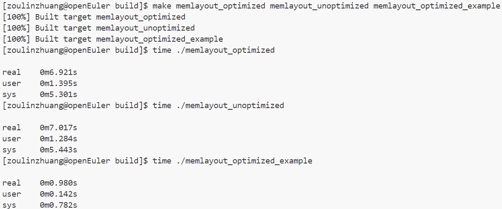
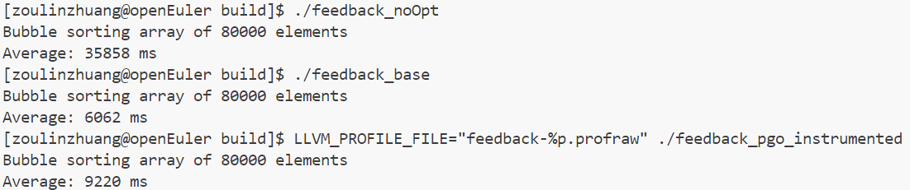

# Lab6 实验报告

姓名 邹林壮 学号 202208040412

## 实验要求

本次实验的主要目的是理解和实践编译器中的内存布局优化和档案导引优化（PGO）。具体来说，实验要求包括：

1. 通过修改编译器代码，实现结构体数组的内存布局优化，以改善数据局部性，提升缓存利用率。
2. 学习和应用档案导引优化（PGO），这是一种自适应优化手段，可以在不修改软件代码的情况下提升性能。
3. 通过实验，比较优化前后的程序性能差异，验证优化效果。

## 实验难点

实验中可能遇到的挑战包括：

1. 对编译器内存布局优化机制的理解不足，需要深入学习编译器如何控制结构体和数组的内存布局。
2. 档案导引优化（PGO）的配置和使用较为复杂，需要掌握如何生成配置文件以及如何利用这些文件进行优化。
3. 实验结果的分析和验证，需要通过运行和反汇编等手段来比较优化前后的性能差异。

## 实验设计

由于实验设计部分需要插入图片，而您提供的链接中并未包含图片，我将根据实验文档内容，提供一个实验设计的概述：

1. **内存布局优化**：通过修改 `src/bisheng/memlayout.cpp` 文件，实现结构体数组的内存布局优化。优化的目标是使得结构体数组中相同字段的访问在内存中是连续的，以提高缓存命中率。

2. **PGO 反馈优化**：使用 `src/bisheng/feedback.cpp` 文件，实现基于档案导引优化的反馈机制。这涉及到使用采样分析器或插桩版本二进制来收集配置文件信息，然后利用这些信息进行代码优化。

3. **性能测试**：通过构建和运行不同的构建目标（如 `memlayout_optimized`, `memlayout_unoptimized`, `feedback_noOpt`, `feedback_base`, `feedback_pgo_instrumented`, `feedback_pgo`），比较优化前后的执行时间，以验证优化效果。

## 性能测试

编译构建并运行`memlayout_optimized`, `memlayout_unoptimized`，`memelayout_optimized_example`,对应的运行结果如下图所示，可以memlayout_optimized相比memlayout_unoptimized看出性能有一定提升，执行memelayout_optimized_example发现性能特别优秀

编译构建并运行`feedback_noOpt`, `feedback_base`, `feedback_pgo_instrumented`, `feedback_pgo`

可以看到未进行优化的程序运行冒泡排序需要的时间特别大，经过优化后，效果都有明显的提升。

## 实验总结

此次实验的收获包括：

1. 深入理解了编译器如何通过内存布局优化来提升程序性能。
2. 学习了档案导引优化（PGO）的原理和实践，包括如何生成和使用配置文件。
3. 掌握了如何通过性能测试来验证优化效果，包括构建、运行和反汇编等技术。

