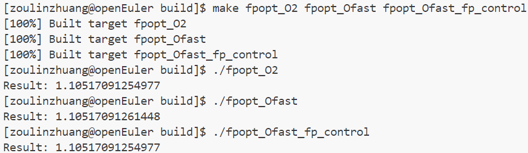

# Lab7 实验报告

姓名 邹林壮 学号 202208040412

## 实验要求

本次实验的核心目标是理解和实践泰山 V110 微架构优化以及浮点精度调优。具体要求如下：

1. 了解泰山 V110 微架构的特点及其在毕昇编译器中的优化原理。
2. 掌握如何在毕昇编译器中指定目标微架构为泰山 V110，以及如何利用其硬件特性进行代码优化。
3. 学习浮点数运算中的精度问题，并掌握如何在编译器优化过程中控制浮点精度，以减少因优化导致的浮点误差。

## 实验难点

实验中可能遇到的挑战包括：

1. 对泰山 V110 微架构及其优化原理的理解，需要深入学习 ARM 架构和毕昇编译器的相关知识。
2. 浮点精度调优的实际操作，需要掌握不同优化级别下浮点运算的行为差异，并学会如何通过编译器选项控制这些行为。
3. 实验结果的分析和验证，需要通过运行和比较不同优化级别下的程序输出，以验证优化效果。

## 实验设计

由于实验设计部分需要插入图片，而您提供的链接中并未包含图片，我将根据实验文档内容，提供一个实验设计的概述：

1. **泰山 V110 微架构优化**：了解泰山 V110 的硬件特性，如向量处理单元和扩展的指令集，并学习如何在毕昇编译器中指定目标微架构为泰山 V110，以利用这些特性进行代码优化。
2. **浮点精度调优**：通过修改 `src/bisheng/fpopt.cpp` 文件，实现浮点精度调优。这涉及到使用不同的编译器优化选项（如 `-O2`、`-Ofast` 和 `fp_control`），并比较这些选项下的浮点运算结果。
3. **性能测试**：构建并运行不同的构建目标（如 `fpopt_O2`、`fpopt_Ofast` 和 `fpopt_Ofast_fp_control`），比较不同优化级别和浮点控制下的输出结果，以验证优化效果。

## 性能测试

```C++
#include <iostream>

int main() {
    double x = 1.0;
    for (int i = 0; i < 1000000; ++i) {
        x += 0.0000001 * x;
    }
    std::cout.precision(15);
    std::cout << "Result: " << x << std::endl;
    return 0;
}
```

程序的主要功能是计算一个循环的累积结果，其中循环体执行了一百万次，每次将当前值乘以一个非常小的数（0.0000001）并加到变量 `x` 上。最后，程序输出 `x` 的值，精确到小数点后15位。

针对这段代码，进行不同优化级别的测试



在执行代码之后可以看出

1. **fpopt_O2**: 使用 `-O2` 优化选项编译的程序。`-O2` 是一个通用的优化级别，它会尝试在不显著增加编译时间的情况下提高性能。在这个级别，编译器会进行一些优化，如循环展开、常量传播等，但不会进行过于激进的优化，以避免可能的浮点精度问题。
2. **fpopt_Ofast**: 使用了 `-Ofast` 优化选项。`-Ofast` 是一个更激进的优化级别，它允许编译器进行可能影响程序行为的优化，以换取更好的性能。这可能包括更激进的循环展开、指令重排等。由于 `-Ofast` 允许改变浮点运算的顺序以提高性能，这可能导致浮点结果与 `-O2` 或未优化版本有所不同。
3. **fpopt_Ofast_fp_control**: 同样使用了 `-Ofast` 优化选项，但增加了 `fp_control` 选项来控制浮点运算的精度。`fp_control` 可以用来指定浮点运算的舍入模式和异常行为，以确保即使在 `-Ofast` 优化级别下，浮点运算也能严格按照代码的书写顺序执行，减少因优化导致的浮点误差。

可以看出该编译器架构可以实现对浮点数的精准度的优化

## 实验总结

此次实验的收获包括：

1. 深入理解了泰山 V110 微架构的特点及其在毕昇编译器中的优化原理。
2. 掌握了如何在编译器优化过程中控制浮点精度，以减少因优化导致的浮点误差。
3. 学会了如何通过性能测试来验证优化效果，包括构建、运行和比较不同优化级别下的程序输出。

